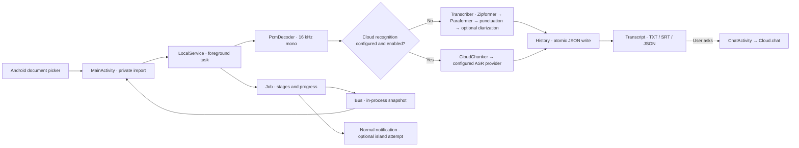

<p align="center"><a href="README.md">简体中文</a> · <strong>English</strong></p>

<div align="center">
  
  <p><strong>Turn an existing recording into text you can read, search and take with you.</strong></p>
  <p>Native Android · Chinese speech transcription · Offline by default · Optional cloud features</p>
  <p>
    <a href="LICENSE"></a>
    
    <a href="https://github.com/zy839971925-zyy/tingxiejian-android/releases/tag/v1.0.3"></a>
  </p>
  <p>
    <a href="#at-a-glance">Overview</a> ·
    <a href="#from-installation-to-export">User guide</a> ·
    <a href="#technical-architecture">Architecture</a> ·
    <a href="#download-and-build">Download / build</a> ·
    <a href="#data-permissions-and-privacy">Privacy</a> ·
    <a href="#licensing-and-distribution">Licensing</a> ·
    <a href="#development-and-acknowledgments">Acknowledgments</a>
  </p>
</div>

> [!IMPORTANT]
> The repository's [MIT license](LICENSE) covers **only original source code and documentation, not the APK as a whole**.
> The public APK includes third-party libraries and models. Redistribution terms for the streaming Zipformer and
> the provenance and terms of `embed.onnx` remain unverified. The app asks users to read and accept third-party terms
> before their first transcription, but **a user's acceptance cannot replace the publisher's redistribution permission**.
> Before downloading, using or redistributing the APK, read the [third-party notices](THIRD_PARTY_NOTICES.md) and
> [disclaimer](DISCLAIMER.en.md). This project grants no rights to those assets. Rights holders may open an Issue to request removal.

## At a glance

| 🎙️ Bring a recording | 📝 Get readable text | 📤 Keep your work |
| :--- | :--- | :--- |
| Choose an existing file with Android's system picker; no microphone or broad storage permission. | Chinese recognition, punctuation and anonymous speaker grouping run locally by default, with stage-based progress. | Review recent results and full transcripts; copy, share, or export TXT, SRT and JSON. |

Tingxiejian is a **transcription tool, not a recorder**. When cloud recognition is not configured and enabled,
starting a transcription does not upload audio for recognition. You may configure a cloud endpoint and API key
for optional recognition or chat. **When valid cloud recognition is enabled, the selected audio is sent to your
configured provider**; the home screen indicates the selected mode.

### What it does

- **Offline-first pipeline:** streaming recognition, Paraformer recheck, automatic punctuation and optional anonymous speaker grouping; completed results stay on the device.
- **Useful output:** read segments, play back retained audio, copy or share text, and export subtitles or structured records.
- **User-controlled extras:** cloud transcription and chat are independently configured; a normal Android foreground notification reports progress.
- **Optional HyperOS island:** attempted only with user opt-in and supported devices. The Shizuku route is experimental;
  normal notifications remain the fallback. **Actual SystemUI rendering is not guaranteed.**
- **Native, adjustable UI:** light/dark themes, system-inset handling, a skippable four-page introduction,
  reversible page transitions and reduced-motion controls. See [UI and motion decisions](docs/UI-MOTION.en.md).

## From installation to export

> **Requirements and limits:** Android 8.0+ on ARM64. The APK is about 516 MiB; initial model setup also copies
> about 500 MiB into the app's private files, so leave additional free space. Import limit: **200 MiB** per file;
> decoded audio limit: **one hour**. Local speaker grouping is skipped with a warning for recordings over **40 minutes**;
> other transcription stages may still run. **The in-app interface is currently Chinese**; English UI names below are
> explanations of the corresponding Chinese controls, not an in-app language switch.

### 01 · Install and open

1. Download `tingxiejian-v1.0.3-arm64-release.apk` from the [v1.0.3 Release](https://github.com/zy839971925-zyy/tingxiejian-android/releases/tag/v1.0.3).
   Read the release's license notice and verify SHA-256. Export important results before upgrading; **do not uninstall
   an older version just to update it**.
2. Confirm the installation source as Android requests. On first launch, read or skip the four-page guide:
   choosing a file → notifications → optional features → welcome. Reopen it later under **Settings → First-use & permissions guide**
   (`设置 → 首次使用与权限指南`).
3. Notifications are optional but help you follow background progress. **Local transcription works without notification
   permission.** The app does not ask for microphone or broad storage access.

<details>
<summary><strong>Verify the APK checksum</strong></summary>

In the directory containing the downloaded APK (Linux / Termux / macOS):

```bash
sha256sum tingxiejian-v1.0.3-arm64-release.apk
# Expected: 7ad11ac88b27f3017dd5bf0a362aea3df4b031674bd10c2d630b9c73f9f3dad1
```

If `sha256sum` is unavailable on macOS, use `shasum -a 256 filename`; in Windows PowerShell use
`Get-FileHash .\tingxiejian-v1.0.3-arm64-release.apk -Algorithm SHA256`.
The [checksum file](https://github.com/zy839971925-zyy/tingxiejian-android/releases/download/v1.0.3/SHA256SUMS-v1.0.3.txt)
accompanies the Release.

</details>

### 02 · Choose a file and prepare models

1. Tap **Choose recording** (`选择录音`) on the home screen. In Android's picker, select an existing audio file
   or a video with an audio track that your device can decode. The app copies only that file into its private cache;
   the screen shows its name, size and duration.
2. Before automatic model setup on the home screen, read the third-party component terms and **actively tick the
   confirmation box**. Models are copied from the APK, not downloaded. You may also prepare them manually under
   **Settings → Offline models** (`设置 → 离线模型`); acceptance is still required before first transcription.
3. Tap **Start transcription** (`开始转写`). Recognition runs on-device by default; the UI shows phases, measurable
   progress and partial text. **Cancel transcription** (`取消转写`) may take a moment because some native model operations
   cannot be interrupted immediately.

> [!TIP]
> A selectable file type is not a guarantee that a device can decode it. If decoding fails, check whether the file
> plays locally and try a shorter, intact recording. Anonymous speaker labels are **not identity verification**.

### 03 · Read, listen and export

When processing finishes, the home screen shows a preview. Tap **View full transcript** (`查看全文`) to read segments.
**Recent** (`最近`) lists only the latest five results. Playback and seeking require the imported temporary audio;
clearing that cache keeps saved text but can disable playback.

| Goal | Where to tap | Outcome |
| :--- | :--- | :--- |
| Copy text | **Copy** (`复制`) on the result or home screen | Plain text without timecodes |
| Share text | **Share** (`分享`) | Android's share sheet with timecoded text; check the recipient app's privacy policy |
| Save a file | **Export** (`导出`) → TXT / SRT / JSON → choose destination | Timecoded text, subtitles or structured data via Android's document picker |
| Ask about the recording | Full transcript → **Ask AI** (`问 AI`) | Requires a configured cloud provider; transcript context and conversation are sent to that provider |

> [!IMPORTANT]
> The app saves completed transcripts locally; this is **not cloud backup**. With `allowBackup=false`, uninstalling
> or installing a differently signed build may lose private history. Export important results to a destination you control.

### 04 · Optional settings

| Setting | When to use it | Caveat |
| :--- | :--- | :--- |
| **Recognition → Speaker grouping / count** (`识别 → 区分发言人／说话人数`) | Multiple speakers or a known speaker count | Can be disabled; skipped for audio over 40 minutes |
| **Appearance / Reduce motion** (`外观／减少动效`) | Dark mode, system theme or fewer transitions | Also respects system animation settings |
| **Cloud AI** (`云端 AI`) | A chosen provider for chat or recognition | Set URL, key and model; **a key alone does not activate cloud recognition**. Turn on the cloud-recognition switch separately. “Test connection” makes a real request |
| **Island / Shizuku** (`超级岛／Shizuku`) | Experimental OEM integration | Optional; can affect other apps' connections or push notifications. Falls back to normal notifications; authorization does not guarantee an island |
| **Clear temporary audio** (`清除临时音频`) | You no longer need playback | **Does not erase saved text**; clearing cloud settings is a separate action |

<details>
<summary><strong>Troubleshooting progress, notifications and cloud mode</strong></summary>

- **First setup seems stuck:** the bundled models must be copied to private storage. Check available space and
  the current phase. An already prepared model is normally not recopied in full.
- **Progress pauses:** some stages, notably speaker grouping, have no measurable internal percentage. The UI
  reports elapsed time instead of inventing a countdown. Long files or memory pressure can make them slower.
- **No HyperOS island:** check ordinary notification permission and the compatibility status in Settings.
  Non-Xiaomi devices and some ROM versions will show only normal notifications; recognition does not depend on the island.
- **Cloud recognition appears unexpectedly:** disable its switch in Settings and check that the home screen says
  “default offline” (`默认离线`) before starting. “Ask AI” is separate and requires an explicit send action;
  you can also clear the cloud configuration if not needed.

</details>

## Technical architecture

> **For developers:** the map below summarizes the implementation. Read the separate
> [architecture deep dive](docs/ARCHITECTURE.en.md) for model setup, service events, data formats, OEM checks,
> build verification and links to source code.



| Layer | Key modules | Responsibility |
| :--- | :--- | :--- |
| **Native UI** | [`MainActivity`](src/com/example/tingxiejian/MainActivity.java), [`WelcomeActivity`](src/com/example/tingxiejian/WelcomeActivity.java), [`TranscriptActivity`](src/com/example/tingxiejian/TranscriptActivity.java) | First-run flow, import, progress and results; `UiTheme` handles light/dark system insets, while `Motion` / `PortalTransition` handle reversible transitions and reduced motion |
| **Task & decoding** | [`LocalService`](src/com/example/tingxiejian/LocalService.java), [`PcmDecoder`](src/com/example/tingxiejian/PcmDecoder.java), [`Job`](src/com/example/tingxiejian/Job.java) | Worker-thread foreground task; `MediaExtractor` / `MediaCodec` to 16 kHz PCM; consistent progress across UI and notifications |
| **Recognition & optional network** | [`ModelPrep`](src/com/example/tingxiejian/ModelPrep.java), [`Transcriber`](src/com/example/tingxiejian/Transcriber.java), [`Cloud`](src/com/example/tingxiejian/Cloud.java) | Nine bundled model files copied to private storage; sherpa-onnx local pipeline by default; cloud path sends WAV chunks; chat requires a separate user action |
| **Records & export** | [`History`](src/com/example/tingxiejian/History.java), [`Exporter`](src/com/example/tingxiejian/Exporter.java), [`Bus`](src/com/example/tingxiejian/Bus.java) | Persist completion atomically before emitting events; Bus is an in-process snapshot, not a database; destination selected through Android's picker |
| **Notification & OEM** | [`XiaomiIslandCapability`](src/com/example/tingxiejian/XiaomiIslandCapability.java), [`XiaomiIslandPublisher`](src/com/example/tingxiejian/XiaomiIslandPublisher.java) | Ordinary notification is the fallback; Shizuku checks require explicit opt-in; publishing a focus payload does not prove SystemUI displayed it |

**Deliberate trade-offs.** This offline-first app uses Java and Android Views, with no WebView, Termux or local HTTP
port required at runtime. Model files are stored uncompressed in the APK and copied into private storage on first
setup; the MIT license does not cover them. `LocalService` **saves to `History` before broadcasting over `Bus`**, so
an Activity rebuild is not solely dependent on a transient callback. A killed process, however, cannot guarantee
resumption of running native recognition. Cloud recognition returns chunk-level segments and **does not run local
Paraformer recheck, punctuation or speaker grouping**. Do not treat the two output paths as identical.[^paths]

[^paths]: Cloud recognition requires the switch, a valid endpoint and key, and a nonempty ASR model name. Chat sends a request only when the user enters a transcript and explicitly sends a message.

## Download and build

### Get a release

- The [v1.0.3 Release](https://github.com/zy839971925-zyy/tingxiejian-android/releases/tag/v1.0.3)
  offers the complete ARM64 APK (about 516 MiB), including offline models. **It is not wholly MIT-licensed.**
  Read the third-party rights notice and disclaimer on the release page first.
- Compare the SHA-256 and signing certificate fingerprint before installation. See [all releases](https://github.com/zy839971925-zyy/tingxiejian-android/releases).
- This Git repository does **not** track `models/`, `vendor/`, `dist/`, signing material or private recordings.
  A clean clone **cannot build the full offline APK** without obtaining the required inputs and rights.

### Build from source

Requires Android ARM64/Termux, Android SDK 35, JDK 21, Python 3, build tools and adequate free space.
See the [building guide](docs/BUILDING.en.md) for dependencies, model paths and signing details. After obtaining
appropriately licensed inputs:

```bash
bash scripts/prepare-libraries.sh
bash design-tools/check-all.sh
bash build.sh
# dist/tingxiejian-v1.0.3-arm64-release.apk
```

`build.sh` uses a locally stored signing identity (created on first build), **not the GitHub publisher's key**.
Builds signed with different keys cannot update one another in place; uninstalling may erase app-private history,
so export it first. Static checks, successful builds and packaging/signature checks **are not device acceptance tests**.
Real devices still need testing for audio, themes, large fonts, reduced motion, back gestures, offline operation and
notification behavior on target ROMs.

## Data, permissions and privacy

| Capability / permission | Trigger and boundary |
| :--- | :--- |
| **File access** | Android's system picker grants access only to the file you select; no microphone or broad file access permission. |
| **Notifications** | Requested when you opt in; denying permission does not prevent local transcription. |
| **Network** | Kept for user-configured cloud ASR and chat; default local recognition does not rely on it. |
| **Shizuku** | Only for the optional experimental island route; core transcription works without it and falls back to ordinary notifications. |
| **Audio & diagnostics** | Imported audio is cached privately for playback and can be cleared in Settings; diagnostics stay private by default. |

Do not post raw recordings, transcripts, logs, API keys or device identifiers in public Issues;
see the [security policy](SECURITY.md) for sensitive reports.
See [architecture](docs/ARCHITECTURE.en.md) and the [disclaimer](DISCLAIMER.en.md) for boundaries.

## Repository map

```text
src/com/example/tingxiejian/  Android Views, foreground service, recognition, export and optional island
res/                         Layouts, themes, animations and drawn resources
design-tools/                Logic, XML, bilingual-doc and feature-boundary checks
scripts/                     Dependency preparation and hash checks
docs/                        Architecture, building, reviews and UI/motion decisions
licenses/                    Third-party notices bundled in local builds
```

Use the [bilingual documentation index](docs/README.en.md) to choose a topic. Start with the
[architecture](docs/ARCHITECTURE.en.md), then read the [changelog](CHANGELOG.en.md).
To contribute, consult the [contribution guide](CONTRIBUTING.md) and run `bash design-tools/check-all.sh` first.
For issue reports, include your ROM/Android version, device, reproduction steps and whether cloud or Shizuku is enabled;
exclude sensitive data.

## Licensing and distribution

- **Original source code and documentation:** [MIT](LICENSE), © 2026 Tingxiejian contributors.
- sherpa-onnx, Shizuku, adaptation sources, models, fonts and other dependencies have their own rights holders
  and terms. See [THIRD_PARTY_NOTICES.md](THIRD_PARTY_NOTICES.md). Model weights are not tracked in Git.
- The APK is a composite of third-party components and **cannot be relicensed as a whole under MIT**.
  Some model rights remain unverified; in-app user consent is not publisher redistribution permission.
  Rights holders may contact us via [Issues](https://github.com/zy839971925-zyy/tingxiejian-android/issues).
- The software is provided as-is. Back up important audio; recognition quality, performance and OEM notification
  behavior are not guaranteed. See [DISCLAIMER.en.md](DISCLAIMER.en.md).

## Development and acknowledgments

[**GPT-6 Sol**](https://developers.openai.com/api/docs/models/gpt-6-sol) assisted development. This project was developed, built and documented on an Android phone using
[Aether (扶摇)](https://github.com/Zhou-Shilin/Aether) as the local development tool.
Many thanks to its creator [@Zhou-Shilin](https://github.com/Zhou-Shilin): making a phone a practical development
workstation is a remarkable achievement!

> Aether is a **development tool**, not an APK runtime dependency. AI-assisted development does not change the
> license terms that apply to this project or its third-party assets.
