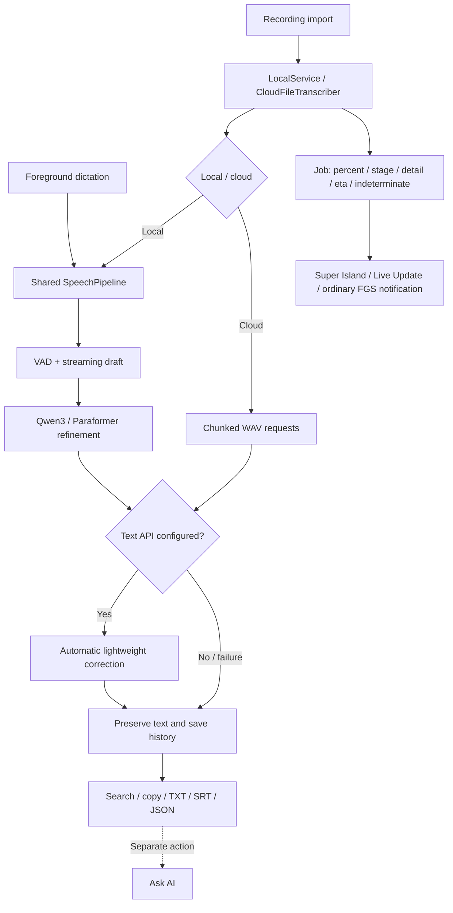

<p align="center"><a href="README.md">简体中文</a> · <strong>English</strong></p>

<div align="center">
  
  <p><strong>Turn recordings and live speech into text you can read, search and export.</strong></p>
  <p>Native Android · Local recognition by default · Qwen3-ASR · Optional cloud text correction</p>
  <p>
    <a href="LICENSE"></a>
    
    <a href="https://github.com/zy839971925-zyy/tingxiejian-android/releases/tag/v1.0.4"></a>
  </p>
  <p><a href="#features">Features</a> · <a href="#from-installation-to-export">Getting started</a> · <a href="#live-progress-and-system-notifications">Notifications</a> · <a href="#architecture">Architecture</a> · <a href="#download-and-build">Build</a> · <a href="#data-permissions-and-privacy">Privacy</a></p>
</div>

## At a glance

Tingxiejian supports **recording import** and **foreground live dictation**. Without cloud configuration, recognition runs locally. Once a valid API key, endpoint and text model are saved, lightweight text correction runs **during transcription**, segment by segment, while preserving the faithful transcript. This is separate from the later “Ask AI” feature.

Current version: **1.0.4-dev**, a complete APK of about **1.49 GB** with Qwen3-ASR 0.6B int8 bundled. No separate model download or import is required. [Download the preview](https://github.com/zy839971925-zyy/tingxiejian-android/releases/tag/v1.0.4) · [Release notes](docs/RELEASE-1.0.4.en.md).

> [!IMPORTANT]
> This APK is a **development-signed preview**. It can update this development signing series, but cannot replace an installation signed with a different historical release certificate. Export important results before changing installations; do not simply uninstall the old app. The source MIT license does not cover the whole APK. Streaming Zipformer redistribution terms remain unresolved. See [third-party notices](THIRD_PARTY_NOTICES.md) and [model provenance](docs/upgrade/MODELS.md).

### Features

| Capability | Current behavior |
| :--- | :--- |
| Recording import | Reads selected audio or a device-decodable video track through the system picker; local processing by default |
| Live dictation | Explicit start requests microphone access; immediate draft and segment refinement, pause/finish controls; recording stops when leaving the foreground |
| Accurate local refinement | Select Qwen3-ASR 0.6B int8 or Paraformer; memory pressure or loading failure triggers a disclosed fallback |
| Correction during transcription | A configured key enables automatic lightweight text correction; missing key is explicitly skipped; faithful and polished text remain separate |
| Results and history | Search the selected text layer, inspect segments, play available cached audio, copy/share and export TXT / SRT / JSON |
| Recording Q&A | A separate “Ask AI” sends transcript context and conversation to the configured service |
| Live progress | Xiaomi Super Island → Android 16 Live Update → ordinary foreground notification; independently throttled surfaces |
| Native UI | Light/dark/system themes, safe areas, large text, natural/quick motion, reduced motion and optional haptics |

Speaker separation and punctuation are optional capabilities. **This APK does not bundle the diarization pack**; unavailable models are reported and skipped. Anonymous labels do not identify real people. Cloud audio recognition has a separate switch and different output granularity from the local pipeline.

## From installation to export

### 01 · Install and onboard

1. Download `tingxiejian-v1.0.4-arm64-dev.apk` and its `.sha256` file from [v1.0.4](https://github.com/zy839971925-zyy/tingxiejian-android/releases/tag/v1.0.4). Requires **Android 8.0+, ARM64**, and storage for both the APK and extracted model files.
2. Allow the installation source as prompted by Android. The four-page guide is skippable and can be reopened from **Settings → First-use and permissions guide**. The app UI currently uses Chinese labels.
3. The guide identifies **Xiaomi Super Island / ColorOS Fluid Cloud / Android native notifications**. Configuration stays in a standalone dialog rather than opening the app Settings screen. Notifications and Shizuku require explicit user actions; Shizuku controls appear only on the Xiaomi path.

```bash
sha256sum -c tingxiejian-v1.0.4-arm64-dev.apk.sha256
# APK SHA-256:
# a0b75988a4f385b7818e36265a4c8c994cca5d4928863e05d3ddf25af2dfa60c
```

Use `shasum -a 256` on macOS or `Get-FileHash filename -Algorithm SHA256` in PowerShell. Certificate and upgrade details are in the [release notes](docs/RELEASE-1.0.4.en.md).

### 02 · Select a model and transcribe

- **Imported recordings:** pick a file on the home screen, explicitly acknowledge third-party terms before the first transcription, then start. The limit is **200 MiB** and **one hour** of decoded audio. Format support depends on device codecs.
- **Live dictation:** open the dictation screen and tap Start before granting microphone access. Pause and Finish are explicit controls; moving to the background ends capture.
- **Model selection:** Settings → Local high-accuracy recognition → **Current model / Tap to switch refinement model** selects Qwen3 or Paraformer. The streaming model still produces the immediate draft; the selected model refines finalized segments.
- **Preparing Qwen:** the screen distinguishes bundled, prepared and missing files. **Prepare bundled Qwen3 model (no download)** shows progress. Preparation also occurs on demand at the first refinement; importing a directory is optional recovery.

Qwen files total about **941 MiB**. The loading guard requires at least **3 GiB of currently available system memory**, not advertised total RAM. Prepared files do not prove successful native loading. Low memory or loading failure preserves recognized text, attempts standard refinement and reports the reason. Initial extraction may take time and additional storage.

### 03 · Automatic correction and cloud ASR

In **Settings → Cloud AI**, enter an API key, an OpenAI-compatible base URL and text model, then **Save and test connection**. A valid saved configuration automatically sends recognized text segments for lightweight correction **during transcription**. **Without a key, this step is explicitly skipped.** It does not wait for “Ask AI”.

- Text configuration alone does not upload audio, but automatic correction sends recognized text over the network.
- Cloud speech recognition additionally requires its own switch and an ASR model; selected audio is uploaded in chunks.
- For fully offline use, disable cloud ASR and clear cloud configuration. Confirm the recognition mode on the home screen.
- The provider must support the actual endpoints used by the app. A successful connection test does not certify every model or ASR endpoint.

### 04 · Read and export

Switch between faithful and polished text on the transcript screen and search the **selected layer**. Copy and export include the whole selected layer, not just search matches. Audio playback requires the temporary cache; clearing audio does not remove saved text.

| Action | Output |
| :--- | :--- |
| Copy | Full text from the selected layer |
| Share | Android share sheet to an app you choose |
| TXT | Readable timestamped text |
| SRT | Subtitles |
| JSON | Structured transcript data |
| Ask AI | Separate transcript-context and conversation request for Q&A or summaries |

History is stored in the private app directory, **not a cloud backup**. System backup is disabled. Uninstallation or switching signing identities can lose history; export important results.

## Live progress and system notifications

| Device / system | Presentation path | Permissions and limits |
| :--- | :--- | :--- |
| Xiaomi / Redmi / POCO, HyperOS | Existing Super Island → Android 16 Live Update if available → ordinary notification | The original island switch only controls Super Island. Shizuku compatibility is separately selected; protocol, focus permission and XMSF gate checks remain |
| OPPO / ColorOS, Android 16+ | Standard Android Live Update → ordinary notification | ColorOS decides whether to render Fluid Cloud; no Seedling/private OPPO API, Root or Shizuku requirement |
| OPPO / ColorOS 14 / 15 | Ordinary notification | No private interface for older Fluid Cloud |
| Other Android 16+ | Native Live Update / promoted ongoing notification → ordinary notification | System promotion permission and the app live-update preference are independent |
| Other Android 8–15 | Ordinary notification | No API 36 execution |

The **ordinary Foreground Service Notification remains the lifecycle foundation for file transcription**. Enhanced presentation never removes it. Xiaomi and Live Update have independent throttles, preserving the existing roughly 220 ms XMSF validation and 5 s update strategy. Bubbles are not automatic fallback; no notification listener or accessibility service has been added.

Settings show the device-specific name, capability state and recent submission diagnostics. **Constructing or submitting a notification does not prove OEM rendering.** The new onboarding flow and ColorOS 16 rendering require device testing. Earlier Xiaomi success was reported on a physical device; preservation checks cover existing source behavior, not a new device acceptance run.

## Architecture

Java + Android Views; **aapt2 → javac → d8** builds. No migration to Gradle, Compose or a web animation runtime.



| Layer | Main modules |
| :--- | :--- |
| Audio and recognition | `AudioSource`, `MicrophoneAudioSource`, `SpeechPipeline`, `RecognitionPipeline`, `VadEngine` |
| Model preparation | `ModelManager`, `ModelInstaller`, `SafModelImporter`: capability-based preparation, verification and atomic generation replacement |
| Correction and cloud | `Cloud`, `TranscriptPolisher`, `SegmentPolishQueue`, `SecureSecretStore` |
| Storage and export | `History`, `SessionRepository`, `SessionLedger`, `Exporter` |
| Notification surfaces | `XiaomiIslandPublisher`, `AndroidLiveUpdatePublisher`, `AndroidLiveUpdateCapability` |
| Guide and motion | `RealtimeSetupDialog`, `RealtimeDeviceProfile`, `Motion`, `UiTheme`, `PortalTransition` |

See [architecture](docs/ARCHITECTURE.en.md) and the [implementation record](docs/upgrade/IMPLEMENTATION.md) for audio, draft, faithful and polished text boundaries and interruption limits. Not every native inference phase can stop immediately; process death does not guarantee automatic inference resumption.

## Download and build

### Versions

[v1.0.4 preview APK](https://github.com/zy839971925-zyy/tingxiejian-android/releases/tag/v1.0.4) · [All releases](https://github.com/zy839971925-zyy/tingxiejian-android/releases) · [Changelog](CHANGELOG.en.md). Historical `v1.0.3` tags and binaries remain unchanged; main contains the newer recognition, data, notification and UI work.

### Build locally

Requires JDK 21, Python 3, Android build-tools and **compile SDK 36**; **minSdk 26 / targetSdk 35** are retained. Libraries, models and signing materials are not tracked. A clean clone cannot immediately create the full model APK. See [building](docs/BUILDING.en.md).

```bash
bash scripts/prepare-libraries.sh
bash design-tools/check-all.sh        # Host checks; no real model inference or device acceptance
bash build.sh --compile-only          # Validate resources, Java and DEX with SDK dependencies present
bash build.sh                        # Full development-signed APK when models are available
# dist/tingxiejian-v1.0.4-arm64-dev.apk
```

Default builds do not impersonate historical release signing. Production signing requires explicit external long-term credentials via `--release` and verified provenance for included models; missing inputs fail closed. The preview retains an unresolved streaming-model redistribution item and does not claim to pass production release gates.

CI runs host checks without real model inference. Local verification covers resources/Java/DEX, signing, zipalign, 13 model assets, regression behavior and Xiaomi preservation. **This is not HyperOS / ColorOS device acceptance.** A short device checklist is in the [feedback record](docs/upgrade/feedback/README.md).

## Data, permissions and privacy

| Data / permission | Trigger |
| :--- | :--- |
| File access | System picker grants the selected file only; no full-storage access |
| Microphone | Explicit live-dictation start; capture stops on leaving the foreground |
| Notifications / live updates | User-managed; denying presentation permission does not make Shizuku a recognition dependency |
| Network | Valid text configuration enables automatic segment correction; cloud ASR separately controls audio upload |
| API key | Android Keystore-protected storage; successful migration removes legacy plaintext; not placed in Activity state or public logs |
| Shizuku | Xiaomi compatibility only; temporary XMSF network-rule changes can affect concurrent connectivity or push notifications |
| History / cache / diagnostics | Private app storage; no automatic diagnostic sharing; clearing audio preserves text |

Do not post raw recordings, transcripts, keys, logs or device identifiers in public issues. See [security](SECURITY.md).

## Licensing and distribution

Original source and documentation use [MIT](LICENSE). The APK includes separately licensed libraries and models and **is not licensed as a whole under MIT**. See the [model manifest](assets/model-manifest.json) for Qwen/Paraformer provenance and hashes. Streaming Zipformer redistribution terms remain unresolved. Historical `embed.onnx` provenance is also unresolved; it is not included in this APK. User acknowledgement and disclaimers cannot replace third-party authorization for the distributor.

Read [third-party notices](THIRD_PARTY_NOTICES.md) and the [disclaimer](DISCLAIMER.en.md). Model weights, SDK binaries, signing identities and private audio do not belong in source history. Accuracy, performance and OEM rendering need actual audio and device testing.

## Development and acknowledgements

Use the [bilingual documentation index](docs/README.en.md) and [contribution guide](CONTRIBUTING.md). Bug reports should include the device, Android/ROM version, reproduction steps and whether cloud or Shizuku is enabled, with sensitive data removed.

The project began with development and builds on an Android phone using [Aether](https://github.com/Zhou-Shilin/Aether). Subsequent engineering, source review and documentation were assisted by OpenAI Codex. Thanks to sherpa-onnx, Qwen, Shizuku and the Xiaomi Super Island reference project; upstream attribution is recorded in the third-party notices.
