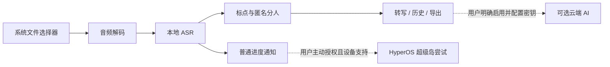

<div align="center">
  
  <br>
  <strong>原生 Android · 中文音频转写 · 默认完全离线</strong>
  <br><br>
  <a href="LICENSE"></a>
  
  
</div>

> **发布边界：**本仓库开放的是经过检查的**源码**，不是模型、MiSans 字体或现有 APK。
> 项目原创代码采用 MIT；第三方适配代码和运行资产遵循各自许可。
> 流式中文模型的再分发许可尚不明确，因此**不要将现有完整 APK、模型权重或字体上传至公开仓库/Release**。
> 详见 [第三方说明](THIRD_PARTY_NOTICES.md)。

## 为什么做这个项目

听写间把一段本地录音转成可读、可查、可导出的中文文字。选择文件后，识别、标点
恢复和匿名发言人区分都可以在手机上完成；没有配置云端 AI 时，不会因为转写而上传音频。
它不是录音器：文件由 Android 系统选择器提供，不要求麦克风或全盘文件权限。

### 功能

- **离线优先：**内置中文流式识别、Paraformer 复核、标点与匿名分人；进度由实际阶段驱动。
- **原生界面：**浅色/深色、系统安全区、大字体和系统减少动画设置；历史、全文、播放器及
  TXT / SRT / JSON 导出。
- **明确选择的云端功能：**可在设置中另行填写服务地址与密钥，启用聊天或云端识别；
  相关网络请求集中在 `Cloud.java`，默认关闭。
- **可选通知增强：**普通 Android 进度通知始终是回退路径；小米 HyperOS 超级岛为可选实验
  适配。Shizuku 需用户主动启动、授权并确认风险，不影响离线核心。
- **首次使用引导：**解释文件选择器、通知权限和可选 Shizuku；可跳过，升级已有安装不会强制弹出。

## 工作方式



> 图中的云端支线不属于默认的本地转写流程。岛适配状态或 `notify()` 成功也不代表
> SystemUI 一定会显示超级岛；用户反馈的具体设备可能正常显示，其他 ROM 仍可能回退。

## 获取与构建

本仓库**没有提供公开可分发的完整 APK**：其中包含权属尚需确认的模型资产。
请在确认相关模型、字体及库的使用权后，自行准备依赖并在 ARM64/Termux 环境构建。
签名密钥必须由构建者自行保存，绝不能上传。完整步骤见
[构建指南](docs/BUILDING.md)，第三方来源见[许可说明](THIRD_PARTY_NOTICES.md)。

```bash
# 依赖和模型就位后
bash scripts/prepare-libraries.sh
bash design-tools/check-all.sh
bash build.sh
# 输出：dist/tingxiejian-v1.0-arm64-release.apk（本机生成，非官方签名）
```

**注意：**构建成功只表明程序和载荷通过静态校验，不替代实机权限、字体、离线模型与
SystemUI 渲染验证。自行生成的新签名通常**无法覆盖安装**他人签名的既有 APK。

## 权限与隐私

| 项目 | 何时使用 |
| --- | --- |
| 通知权限 | 用户在引导页或设置中主动授予，用于处理进度；拒绝不妨碍离线识别。 |
| Shizuku 权限 | 仅用户主动启用超级岛实验功能后申请；其临时网络规则调整存在影响推送的风险，恢复为尽力而为。 |
| 网络权限 | 仅为用户自行配置并启用的云端 AI/识别功能保留；离线工作流不需要联网。 |
| 文件访问 | 系统文件选择器为被选中的音频提供临时授权；无需全盘文件或麦克风权限。 |

诊断报告在应用侧通过 Android MediaStore 保存，分享日志时请删除文件名、录音内容、
密钥和设备标识。更多实现细节见[架构说明](docs/ARCHITECTURE.md)。

## 项目结构

```text
src/com/example/tingxiejian/  原生界面、服务、离线流水线与可选岛适配
res/                         Android 布局、主题和自有矢量图（不含受限字体）
design-tools/                纯逻辑、布局、载荷及边界回归检查
scripts/                     本地依赖准备（不下载受限模型）
docs/                        构建指南、架构、更新记录与自绘图
licenses/                    适配代码所需的 Apache-2.0 许可文本
```

`models/`、`vendor/`、`build/`、`dist/`、签名材料和用户数据均被 `.gitignore` 排除。
这既避免 GitHub 大文件限制，也避免错误地以 MIT 重新授权第三方资产。

## 参与开发

欢迎提交可复现的问题与小范围 PR。提交前运行 `bash design-tools/check-all.sh`，并阅读
[贡献指南](CONTRIBUTING.md)和[安全说明](SECURITY.md)。请勿附上未脱敏录音、API Key、
应用私钥、模型权重或带有个人信息的截图。

## 许可

项目原创代码与文档：**[MIT](LICENSE)**，© 2026 Tingxiejian contributors。
基于 Apache-2.0 项目改写的适配部分，以及第三方库、模型、字体，不因位于同一工程而
变成 MIT；请参阅 [THIRD_PARTY_NOTICES.md](THIRD_PARTY_NOTICES.md)。
