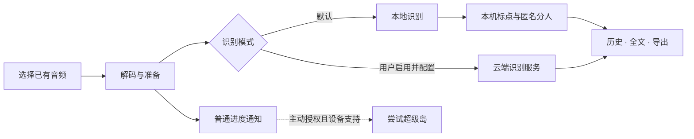

<div align="center">
  
  <p><strong>把一段录音，整理成可以阅读、检索与带走的文字。</strong></p>
  <p>原生 Android · 中文音频转写 · 默认离线 · 云端能力自选</p>
  <p>
    <a href="LICENSE"></a>
    
    <a href="https://github.com/zy839971925-zyy/tingxiejian-android/releases/tag/v1.0.3"></a>
  </p>
  <p>
    <a href="#能做什么">能做什么</a> ·
    <a href="#如何使用">如何使用</a> ·
    <a href="#获取与构建">获取与构建</a> ·
    <a href="#数据权限与隐私">数据与隐私</a> ·
    <a href="#许可与发布边界">许可边界</a>
  </p>
</div>

> [!IMPORTANT]
> 仓库的 [MIT 许可](LICENSE) **仅覆盖原创源码和文档，不覆盖安装包**。公开 APK 内含第三方
> 库和模型：流式 Zipformer 的再分发条款、`embed.onnx` 的来源与条款仍未核实。
> 应用首次转写前会要求阅读并勾选第三方条款，但**用户的使用确认不能替代发布者需要取得的再分发许可**。
> 下载、使用或再次分发前请阅读[第三方清单](THIRD_PARTY_NOTICES.md)和[免责声明](DISCLAIMER.md)；
> 本项目不授予这些资产的权利。权利人若有异议，请通过 Issue 联系移除。

## 一眼了解

| 🎙️ 录音进来 | 📝 文字出来 | 📤 成果带走 |
| :--- | :--- | :--- |
| 从 Android 系统文件选择器导入已有音频；不需要麦克风或全盘文件权限。 | 默认在本机完成中文识别、标点恢复与匿名发言人区分，按实际阶段显示进度。 | 查看历史与全文，复制、分享，或导出 TXT、SRT、JSON。 |

听写间是**转写工具，不是录音器**。它尽可能让处理留在设备上：没有启用并配置云端识别时，
开始转写不会为了识别而上传音频。需要云端问答或识别时，可以在设置中自行填写服务地址与密钥；
**启用有效的云端识别后，所选音频会发送至配置的服务**，首页也会显示当前模式。

### 能做什么

- **离线优先的处理链路：**流式识别、Paraformer 复核、自动标点、匿名分人；完成后在应用内保存结果。
- **让内容更好用：**按段阅读和试听，查看全文与历史，按需导出字幕及结构化结果。
- **把选择权留给用户：**云端识别与对话独立配置；普通 Android 前台通知可显示任务进度。
- **可选的 HyperOS 超级岛：**仅在用户主动配置、设备支持时尝试；需要 Shizuku 的路径是实验性的，
  不可用时回退普通通知，**不保证每台设备都会显示超级岛**。
- **原生、可控制的界面：**浅色／深色主题、系统安全区、四页可跳过的首次引导、双向页面转场；
  尊重系统动画设置，也提供应用内“减少动效”。设计取舍见[界面与动效决策](docs/UI-MOTION.md)。

## 如何使用

1. 首次打开时阅读四页引导，按需授予**通知**权限；也可跳过，日后从设置重看。
2. 点“选择录音”，用系统文件选择器挑选已有音频。无需授予录音或整个存储空间权限。
3. 开始转写并等待各阶段结束；第一次转写前，应用会展示第三方组件条款，要求阅读并勾选确认。
4. 从历史进入转写结果，阅读、试听或导出。若选择配置云端功能，请先了解相应服务的数据政策。



> 云端识别分支不是默认行为。文件选择器、通知授权界面和系统分享面板由 Android 提供；
> 超级岛是否出现由设备的 SystemUI 决定。

## 获取与构建

### 获取版本

- [v1.0.3 Release](https://github.com/zy839971925-zyy/tingxiejian-android/releases/tag/v1.0.3) 提供
  ARM64 完整安装包（约 516 MiB），内含离线模型，**不是 MIT 产物**。请先阅读该页的第三方条款和免责声明。
- 下载前核对 Release 中的 SHA-256 与签名指纹。其他版本见[发布记录](https://github.com/zy839971925-zyy/tingxiejian-android/releases)。
- 本仓库不跟踪 `models/`、`vendor/`、`dist/`、签名材料或私有录音。干净的克隆仓库
  **无法直接生成完整离线 APK**；先取得具有适当使用及打包许可的依赖和模型。

### 自行构建

需要 Android ARM64/Termux、Android SDK 35、JDK 21、Python 3、构建工具与足够空间。
完整依赖列表、模型路径及签名说明见[构建指南](docs/BUILDING.md)。获得合规的构建输入后：

```bash
bash scripts/prepare-libraries.sh
bash design-tools/check-all.sh
bash build.sh
# dist/tingxiejian-v1.0.3-arm64-release.apk
```

`build.sh` 使用本机保存的签名身份（首次构建时创建），**不是 GitHub 官方签名**。
不同签名不能直接覆盖安装；卸载旧应用可能删除本机历史，请先导出重要结果。
静态检查、构建、签名与模型打包校验也**不等于实机验收**：仍需测试真实音频、深浅色、
大字体、减少动效、返回手势、离线运行及目标设备上的通知行为。

## 数据、权限与隐私

| 能力 / 权限 | 触发条件与边界 |
| :--- | :--- |
| **文件访问** | 通过 Android 系统选择器，仅获得所选文件的访问权；不申请全盘文件或麦克风权限。 |
| **通知** | 用户主动授权后用于显示进度；拒绝不影响本地转写。 |
| **网络** | 为用户自行启用并配置的云端识别／问答保留；默认本地识别不依赖网络。 |
| **Shizuku** | 仅可选的超级岛实验路径使用；不授权也可以使用核心转写，系统限制下会回退普通通知。 |
| **音频与诊断** | 导入音频缓存在应用私有目录以供试听，可在设置中清除；诊断默认仅保存在应用私有目录。 |

请勿将未脱敏的录音、转写、日志、API Key 或设备标识贴入公开 Issue。
更多实现边界见[架构说明](docs/ARCHITECTURE.md)和[免责声明](DISCLAIMER.md)。

## 工程导览

```text
src/com/example/tingxiejian/  Android Views、前台服务、识别流程、导出及可选岛适配
res/                         布局、主题、动画与自绘资源
design-tools/                逻辑、XML、打包与功能边界回归检查
scripts/                     构建依赖准备及哈希校验
docs/                        架构、构建、审查与 UI 动效文档
licenses/                    随本地构建打包的第三方许可文本
```

从[架构](docs/ARCHITECTURE.md)了解数据流，从[更新记录](CHANGELOG.md)看版本变化；
希望参与开发，可阅读[贡献指南](CONTRIBUTING.md)并先运行 `bash design-tools/check-all.sh`。
报告问题时请注明系统版本、机型、操作路径及是否启用云端或 Shizuku，勿附带敏感数据。

## 许可与发布边界

- 本项目**原创代码与文档**：[MIT](LICENSE)，© 2026 Tingxiejian contributors。
- sherpa-onnx、Shizuku、适配来源、模型、字体等有各自权利人和条款：见
  [THIRD_PARTY_NOTICES.md](THIRD_PARTY_NOTICES.md)。源码仓库不提供第三方模型权重。
- APK 是第三方组件的组合物，**不能以 MIT 整体授权**。部分模型权利状态未核实；
  首次使用时的条款确认不意味着项目获得了模型再分发权。权利人可通过 [Issues](https://github.com/zy839971925-zyy/tingxiejian-android/issues) 联系。
- 软件按原样提供。重要录音请先备份；识别结果、性能和 OEM 通知表现不作保证。
  完整说明见 [DISCLAIMER.md](DISCLAIMER.md)。
