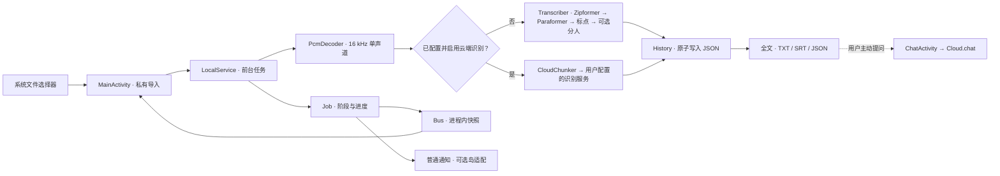

<p align="center"><strong>简体中文</strong> · <a href="README.en.md">English</a></p>

<div align="center">
  
  <p><strong>把一段录音，整理成可以阅读、检索与带走的文字。</strong></p>
  <p>原生 Android · 中文音频转写 · 默认离线 · 云端能力自选</p>
  <p>
    <a href="LICENSE"></a>
    
    <a href="https://github.com/zy839971925-zyy/tingxiejian-android/releases/tag/v1.0.3"></a>
  </p>
  <p>
    <a href="#能做什么">能做什么</a> ·
    <a href="#从安装到导出">使用指南</a> ·
    <a href="#技术架构">技术架构</a> ·
    <a href="#获取与构建">获取与构建</a> ·
    <a href="#数据权限与隐私">数据与隐私</a> ·
    <a href="#许可与发布边界">许可边界</a> ·
    <a href="#开发与致谢">开发与致谢</a>
  </p>
</div>

> [!IMPORTANT]
> 仓库的 [MIT 许可](LICENSE) **仅覆盖原创源码和文档，不覆盖安装包**。公开 APK 内含第三方
> 库和模型：流式 Zipformer 的再分发条款、`embed.onnx` 的来源与条款仍未核实。
> 应用首次转写前会要求阅读并勾选第三方条款，但**用户的使用确认不能替代发布者需要取得的再分发许可**。
> 下载、使用或再次分发前请阅读[第三方清单](THIRD_PARTY_NOTICES.zh-CN.md)和[免责声明](DISCLAIMER.md)；
> 本项目不授予这些资产的权利。权利人若有异议，请通过 Issue 联系移除。

## 一眼了解

| 🎙️ 录音进来 | 📝 文字出来 | 📤 成果带走 |
| :--- | :--- | :--- |
| 从 Android 系统文件选择器导入已有音频；不需要麦克风或全盘文件权限。 | 默认在本机完成中文识别、标点恢复与匿名发言人区分，按实际阶段显示进度。 | 查看历史与全文，复制、分享，或导出 TXT、SRT、JSON。 |

听写间是**转写工具，不是录音器**。它尽可能让处理留在设备上：没有启用并配置云端识别时，
开始转写不会为了识别而上传音频。需要云端问答或识别时，可以在设置中自行填写服务地址与密钥；
**启用有效的云端识别后，所选音频会发送至配置的服务**，首页也会显示当前模式。

### 能做什么

- **离线优先的处理链路：**流式识别、Paraformer 复核、自动标点、匿名分人；完成后在应用内保存结果。
- **让内容更好用：**按段阅读和试听，查看全文与历史，按需导出字幕及结构化结果。
- **把选择权留给用户：**云端识别与对话独立配置；普通 Android 前台通知可显示任务进度。
- **可选的 HyperOS 超级岛：**仅在用户主动配置、设备支持时尝试；需要 Shizuku 的路径是实验性的，
  不可用时回退普通通知，**不保证每台设备都会显示超级岛**。
- **原生、可控制的界面：**浅色／深色主题、系统安全区、四页可跳过的首次引导、双向页面转场；
  尊重系统动画设置，也提供应用内“减少动效”。设计取舍见[界面与动效决策](docs/UI-MOTION.md)。

## 从安装到导出

> **适用范围：**Android 8.0+、ARM64。APK 约 516 MiB；首次模型准备还会在应用私有目录
> 复制约 500 MiB，请预留额外空间。文件导入上限 **200 MiB**、解码后音频时长上限 **1 小时**；
> 本地匿名分人对超过 **40 分钟**的录音会跳过并提示，其余转写仍可进行。

### 01 · 安装与首次打开

1. 从 [v1.0.3 Release](https://github.com/zy839971925-zyy/tingxiejian-android/releases/tag/v1.0.3)
   下载 `tingxiejian-v1.0.3-arm64-release.apk`，对照发布页的许可说明和 SHA-256；
   安装前先导出旧版中的重要结果，**不要为了升级直接卸载旧版**。
2. 在 Android 的安装界面按系统提示确认安装来源。首次启动可阅读四页引导：
   文件选择 → 通知权限 → 可选能力 → 欢迎使用。引导能跳过，之后可从**设置 → 首次使用与权限指南**重新打开。
3. 按需允许通知，以便在后台看到普通进度通知；**不授权也能使用本地转写**。
   应用不要求麦克风或全盘文件权限。

<details>
<summary><strong>想校验安装包？展开查看命令</strong></summary>

在保存 APK 的目录运行（Linux / Termux / macOS）：

```bash
sha256sum tingxiejian-v1.0.3-arm64-release.apk
# 预期：7ad11ac88b27f3017dd5bf0a362aea3df4b031674bd10c2d630b9c73f9f3dad1
```

macOS 若没有 `sha256sum`，可用 `shasum -a 256 文件名`；Windows PowerShell 可用
`Get-FileHash .\tingxiejian-v1.0.3-arm64-release.apk -Algorithm SHA256`。
[校验文件](https://github.com/zy839971925-zyy/tingxiejian-android/releases/download/v1.0.3/SHA256SUMS-v1.0.3.txt)
也随 Release 提供。

</details>

### 02 · 选择录音与准备模型

1. 首页点**选择录音**；在 Android 系统文件选择器中选已有的音频，或选有音轨且设备能解码的视频。
   应用只读取你选中的文件，复制到私有缓存；页面会显示文件名、大小和时长。
2. 首页第一次准备离线模型前，会要求阅读第三方组件条款并**主动勾选确认**；模型从 APK
   复制到本机，不从网络下载。也可到**设置 → 离线模型**手动准备；无论如何，首次转写前仍需确认条款。
3. 点**开始转写**。默认在本机识别；页面显示正在处理的阶段、可用的进度及已识别文本。
   转写中可点**取消转写**，但某些原生模型运算无法立即中断，请给它一点时间。

> [!TIP]
> 文件选择器支持的扩展名不等于设备一定能解码。无法读取时，先检查文件能否在本机播放，
> 再尝试换一段较短、未损坏的录音。匿名说话人标签只是机器分组，**不是身份认证**。

### 03 · 阅读、试听、导出

完成后首页展示摘要和预览。点**查看全文**阅读分段；首页的**最近**只显示最后 5 条。
如仍保有导入时的临时音频，可使用播放和进度拖动；清除缓存后文字保留，试听可能不可用。

| 你想做什么 | 在哪里操作 | 得到什么 |
| :--- | :--- | :--- |
| 复制纯文字 | 结果页或首页 → **复制** | 无时间戳的可粘贴全文 |
| 发给其他应用 | **分享** | Android 分享面板中的带时间转写文本；请自行检查接收应用的隐私条款 |
| 导出文件 | **导出** → TXT / SRT / JSON → 选保存位置 | 带时间文本／字幕／结构化记录；位置由系统文档选择器决定 |
| 针对录音提问 | 全文 → **问 AI** | 需要先在设置中配置云端服务；转写内容和对话会作为请求上下文发送给所选服务 |

> [!IMPORTANT]
> 转写完成会在应用内保存历史，但不是云备份。`allowBackup=false`，卸载或更换签名安装
> 可能丢失私有历史；重要结果请及时导出到自己选择的位置。

### 04 · 按需调整（默认不必设置）

| 设置位置 | 适合何时开启 | 注意 |
| :--- | :--- | :--- |
| 设置 → 识别 → 区分发言人／说话人数 | 多人录音，或已知说话人数 | 可关闭分人；超过 40 分钟自动跳过该阶段 |
| 设置 → 外观／减少动效 | 需要深色、跟随系统或希望少些转场 | 也尊重系统关闭动画的设置 |
| 设置 → 云端 AI | 确定要使用自选服务的问答或语音识别 | 填地址、Key、模型；**只填写 Key 不会自动启用云端识别**，还要打开云端识别开关；“测试连接”会发起实际请求 |
| 设置 → 超级岛／Shizuku | 了解实验性 OEM 兼容路径的用户 | 非转写必需，可能影响其他应用的连接或推送；失败回退普通通知，授权不保证显示岛 |
| 设置 → 清除临时音频 | 转写完成且不再需要本机试听 | **不删除已保存的文字**；清除云端配置是另一项独立操作 |

<details>
<summary><strong>常见情况：进度、通知与云端模式</strong></summary>

- **第一次一直显示“准备模型”**：APK 中的模型需要复制到应用私有目录；检查剩余空间，
  保持应用运行并观察阶段信息。模型已准备好后通常不再重复完整复制。
- **进度暂时不变**：分人等阶段没有可测的内部百分比，界面会显示已用时间而非虚构倒计时；
  大音频或设备内存压力可能使这一阶段更久。
- **没有超级岛**：先看普通通知是否允许，再检查设置页的能力状态；非小米设备及部分 ROM
  只会显示普通通知，模型识别不依赖岛。
- **显示云端识别，但不想上传**：回到设置关闭“云端识别”；回到首页确认已显示“默认离线”后再开始。
  “问 AI”仍是独立的用户发起操作，若不需要可清空云端配置。

</details>

## 技术架构

> **给开发者的阅读路线：**下面是实现地图；模型准备、服务与回调、数据格式、OEM 门禁、
> 构建校验的逐层分析和源码链接，见独立的[技术架构详解](docs/ARCHITECTURE.md)。



| 层次 | 关键模块 | 实际职责 |
| :--- | :--- | :--- |
| **原生界面** | [`MainActivity`](src/com/example/tingxiejian/MainActivity.java)、[`WelcomeActivity`](src/com/example/tingxiejian/WelcomeActivity.java)、[`TranscriptActivity`](src/com/example/tingxiejian/TranscriptActivity.java) | 首次引导、导入、进度、结果；`UiTheme` 处理日夜主题和系统安全区，`Motion` / `PortalTransition` 处理可降低的双向动效 |
| **任务与解码** | [`LocalService`](src/com/example/tingxiejian/LocalService.java)、[`PcmDecoder`](src/com/example/tingxiejian/PcmDecoder.java)、[`Job`](src/com/example/tingxiejian/Job.java) | 服务工作线程处理任务，`MediaExtractor` / `MediaCodec` 解码到 16 kHz；同一进度映射用于 UI 和通知 |
| **识别与可选联网** | [`ModelPrep`](src/com/example/tingxiejian/ModelPrep.java)、[`Transcriber`](src/com/example/tingxiejian/Transcriber.java)、[`Cloud`](src/com/example/tingxiejian/Cloud.java) | APK 内九个模型复制至私有目录；默认 sherpa-onnx 本地链路；云端分支上传分段 WAV，聊天单独触发 |
| **数据与导出** | [`History`](src/com/example/tingxiejian/History.java)、[`Exporter`](src/com/example/tingxiejian/Exporter.java)、[`Bus`](src/com/example/tingxiejian/Bus.java) | 完成结果先原子保存再发事件；Bus 只是同进程快照，不是持久数据库；导出由系统文件选择器决定目的地 |
| **通知与 OEM** | [`XiaomiIslandCapability`](src/com/example/tingxiejian/XiaomiIslandCapability.java)、[`XiaomiIslandPublisher`](src/com/example/tingxiejian/XiaomiIslandPublisher.java) | 普通通知始终是回退；Shizuku 门禁是明确授权的实验性路径，提交焦点通知不等于 SystemUI 已展示 |

**关键取舍。**这是 Java + Android Views 的离线优先应用，运行时没有 WebView、Termux 或本地 HTTP 端口。
模型在 APK 中以未压缩资源打包，首次复制到私有文件目录；它们仍不是 MIT 资产。
转写结果由 `LocalService` **先写 `History` 再发 `Bus` 事件**，所以 Activity 重建不必依赖瞬时回调；
但进程被系统终止时，运行中的原生模型计算不保证自动恢复。云端识别返回块级段落，
**不经过本地复核、标点与匿名分人**，不要把两条路径误当成完全同质的输出。[^paths]

[^paths]: 识别模式要求设置开关、有效服务地址与 Key、非空语音识别模型同时成立；聊天则只在用户进入全文并主动发送消息时调用云端。

## 获取与构建

### 获取版本

- [v1.0.3 Release](https://github.com/zy839971925-zyy/tingxiejian-android/releases/tag/v1.0.3) 提供
  ARM64 完整安装包（约 516 MiB），内含离线模型，**不是 MIT 产物**。请先阅读该页的第三方条款和免责声明。
- 下载前核对 Release 中的 SHA-256 与签名指纹。其他版本见[发布记录](https://github.com/zy839971925-zyy/tingxiejian-android/releases)。
- 本仓库不跟踪 `models/`、`vendor/`、`dist/`、签名材料或私有录音。干净的克隆仓库
  **无法直接生成完整离线 APK**；先取得具有适当使用及打包许可的依赖和模型。

### 自行构建

需要 Android ARM64/Termux、Android SDK 35、JDK 21、Python 3、构建工具与足够空间。
完整依赖列表、模型路径及签名说明见[构建指南](docs/BUILDING.md)。获得合规的构建输入后：

```bash
bash scripts/prepare-libraries.sh
bash design-tools/check-all.sh
bash build.sh
# dist/tingxiejian-v1.0.3-arm64-release.apk
```

`build.sh` 使用本机保存的签名身份（首次构建时创建），**不是 GitHub 官方签名**。
不同签名不能直接覆盖安装；卸载旧应用可能删除本机历史，请先导出重要结果。
静态检查、构建、签名与模型打包校验也**不等于实机验收**：仍需测试真实音频、深浅色、
大字体、减少动效、返回手势、离线运行及目标设备上的通知行为。

## 数据、权限与隐私

| 能力 / 权限 | 触发条件与边界 |
| :--- | :--- |
| **文件访问** | 通过 Android 系统选择器，仅获得所选文件的访问权；不申请全盘文件或麦克风权限。 |
| **通知** | 用户主动授权后用于显示进度；拒绝不影响本地转写。 |
| **网络** | 为用户自行启用并配置的云端识别／问答保留；默认本地识别不依赖网络。 |
| **Shizuku** | 仅可选的超级岛实验路径使用；不授权也可以使用核心转写，系统限制下会回退普通通知。 |
| **音频与诊断** | 导入音频缓存在应用私有目录以供试听，可在设置中清除；诊断默认仅保存在应用私有目录。 |

请勿将未脱敏的录音、转写、日志、API Key 或设备标识贴入公开 Issue；安全问题请按[安全说明](SECURITY.zh-CN.md)处理。
更多实现边界见[架构说明](docs/ARCHITECTURE.md)和[免责声明](DISCLAIMER.md)。

## 工程导览

```text
src/com/example/tingxiejian/  Android Views、前台服务、识别流程、导出及可选岛适配
res/                         布局、主题、动画与自绘资源
design-tools/                逻辑、XML、双语文档与功能边界回归检查
scripts/                     构建依赖准备及哈希校验
docs/                        架构、构建、审查与 UI 动效文档
licenses/                    随本地构建打包的第三方许可文本
```

从[双语文档索引](docs/README.md)按主题查阅，从[架构](docs/ARCHITECTURE.md)了解数据流，
从[更新记录](CHANGELOG.md)看版本变化；希望参与开发，可阅读[贡献指南](CONTRIBUTING.zh-CN.md)
并先运行 `bash design-tools/check-all.sh`。
报告问题时请注明系统版本、机型、操作路径及是否启用云端或 Shizuku，勿附带敏感数据。

## 许可与发布边界

- 本项目**原创代码与文档**：[MIT](LICENSE)，© 2026 Tingxiejian contributors。
- sherpa-onnx、Shizuku、适配来源、模型、字体等有各自权利人和条款：见
  [第三方清单](THIRD_PARTY_NOTICES.zh-CN.md)。源码仓库不提供第三方模型权重。
- APK 是第三方组件的组合物，**不能以 MIT 整体授权**。部分模型权利状态未核实；
  首次使用时的条款确认不意味着项目获得了模型再分发权。权利人可通过 [Issues](https://github.com/zy839971925-zyy/tingxiejian-android/issues) 联系。
- 软件按原样提供。重要录音请先备份；识别结果、性能和 OEM 通知表现不作保证。
  完整说明见 [DISCLAIMER.md](DISCLAIMER.md)。

## 开发与致谢

开发过程中使用 [**GPT-6 Sol**](https://developers.openai.com/api/docs/models/gpt-6-sol) 辅助；本项目的开发、构建与文档整理均在 Android 手机上，
借助 [Aether 扶摇](https://github.com/Zhou-Shilin/Aether) 的本地工具环境完成。
特别感谢 Aether 作者 [@Zhou-Shilin](https://github.com/Zhou-Shilin)：让手机成为真正可用的开发环境，非常了不起！

> Aether 是**开发工具**，不是听写间 APK 的运行依赖；模型参与开发也不改变项目及第三方资产各自的许可边界。
