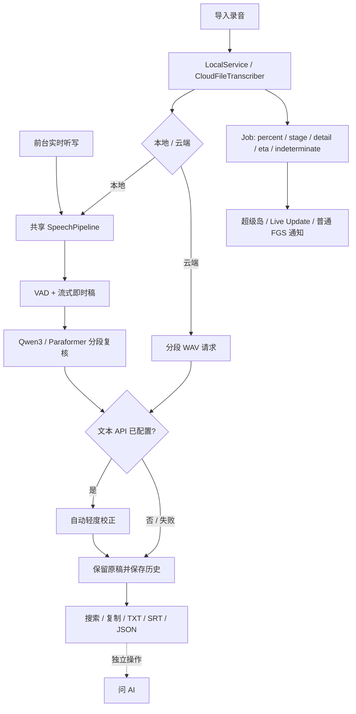

<p align="center"><strong>简体中文</strong> · <a href="README.en.md">English</a></p>

<div align="center">
  
  <p><strong>把录音与实时语音，变成可以阅读、检索和带走的文字。</strong></p>
  <p>原生 Android · 默认本地识别 · Qwen3-ASR · 可选云端文本校正</p>
  <p>
    <a href="LICENSE"></a>
    
    <a href="https://github.com/zy839971925-zyy/tingxiejian-android/releases/tag/v1.0.4"></a>
  </p>
  <p><a href="#能做什么">功能</a> · <a href="#从安装到导出">使用指南</a> · <a href="#实时进度与系统通知">系统通知</a> · <a href="#技术架构">架构</a> · <a href="#获取与构建">构建</a> · <a href="#数据权限与隐私">隐私</a></p>
</div>

## 一眼了解

听写间支持**导入录音**和**前台实时听写**。没有云端配置时，识别在本机完成；保存有效的 API Key、接口与文本模型后，会在**转写过程中**逐段进行轻度文本校正，保留忠实稿。这与完成后的“问 AI”是两个独立功能。

当前版本 **1.0.4-dev**：完整 APK 约 **1.49 GB**，内置 Qwen3-ASR 0.6B int8，无需另行下载或导入模型。[下载正式版](https://github.com/zy839971925-zyy/tingxiejian-android/releases/tag/v1.0.4) · [本次发布说明](docs/RELEASE-1.0.4.md)。

> [!IMPORTANT]
> 当前 APK 使用**开发签名**（构建标识 `1.0.4-dev` / versionCode 104），随 v1.0.4 正式版发布。可覆盖更新本次开发签名系列，不能直接覆盖不同签名的历史正式版；不要直接卸载旧版，先导出重要结果。源码与文档的 MIT 许可不覆盖整个 APK。流式 Zipformer 的再分发条款仍未核实；模型权重保留各自条款，详见[第三方清单](THIRD_PARTY_NOTICES.zh-CN.md)和[模型来源记录](docs/upgrade/MODELS.md)。

### 能做什么

| 能力 | 当前行为 |
| :--- | :--- |
| 导入录音 | 系统文件选择器读取所选音频或设备能解码的视频音轨，默认本地处理 |
| 实时听写 | 显式开始后采集麦克风，显示即时稿，按段复核；支持暂停和结束，离开前台会停止采集 |
| 本地高精度复核 | Qwen3-ASR 0.6B int8 / Paraformer 可切换；内存不足或加载失败时降级并提示 |
| 转写途中文本校正 | 配置有效 Key 后自动进行轻度校正；无 Key 则明确跳过；忠实稿、整理稿分开保留 |
| 结果与历史 | 当前文本层搜索、分段查看与可用缓存音频试听；复制、分享、TXT / SRT / JSON 导出 |
| 录音问答 | 独立的“问 AI”，发送转写文本和对话到配置的服务 |
| 实时进度 | 小米超级岛 → Android 16 实时活动 → 普通前台通知；各层独立控制更新 |
| 原生界面 | 深浅色与系统主题、安全区、大字体、自然/轻快动效、减少动效与触觉反馈 |

匿名分人与标点是可选能力；**本次 APK 未包含分人模型包**，缺失时提示并跳过，不能据此识别真实身份。云端音频识别是单独开关，与本地复核的输出粒度和能力不同。

## 从安装到导出

### 01 · 安装与引导

1. 从 [v1.0.4 Release](https://github.com/zy839971925-zyy/tingxiejian-android/releases/tag/v1.0.4) 下载 `tingxiejian-v1.0.4-arm64-dev.apk` 与同名 `.sha256` 文件。需要 **Android 8.0+、ARM64**，预留 APK 和模型复制所需空间。
2. 按系统提示允许该安装来源，完成安装。四页引导可以跳过，稍后从**设置 → 首次使用与权限指南**重开。
3. 引导根据设备显示**超级岛 / ColorOS 流体云 / Android 原生通知**，配置保留在独立弹窗中，不会跳进应用设置。通知与 Shizuku 均通过明确点击授权；Shizuku 只在小米可选路径出现。

```bash
sha256sum -c tingxiejian-v1.0.4-arm64-dev.apk.sha256
# APK SHA-256:
# a0b75988a4f385b7818e36265a4c8c994cca5d4928863e05d3ddf25af2dfa60c
```

macOS 可用 `shasum -a 256`，Windows PowerShell 可用 `Get-FileHash 文件名 -Algorithm SHA256`。签名指纹和安装边界见[发布说明](docs/RELEASE-1.0.4.md)。

### 02 · 选择模型与开始转写

- **导入录音：**首页选择文件，首次转写前阅读并主动确认第三方条款，然后开始转写。文件上限 **200 MiB**，解码后音频上限 **1 小时**；支持的扩展名仍取决于设备解码器。
- **实时听写：**在首页进入听写界面，点击开始后才申请麦克风权限。暂停/结束由用户控制；切后台会停止录音，避免隐蔽采集。
- **模型切换：**设置 → 本地高精度识别 → **当前模型 / 点击切换复核模型**，选择 Qwen3 或 Paraformer。即时稿仍由流式模型产生，所选模型用于后续逐段复核。
- **Qwen 准备：**页面明确区分已内置、已准备与缺失。可点**准备内置 Qwen3 模型（无需下载）**观察进度，也会在首次复核时按需准备；目录导入只是可选的手动恢复入口。

Qwen 模型约 **941 MiB**，加载守卫要求至少 **3 GiB 可用系统内存**，不是手机标称总内存。文件已准备不等于原生模型已加载；加载失败或内存不足时保留已识别文字，尝试标准复核并提示。首次准备可能较慢，请留意空间与阶段信息。

### 03 · 自动文本校正与云端识别

设置 → **云端 AI** 填入 API Key、OpenAI 兼容 base URL、文本模型，选择**保存并测试连接**。保存有效配置后，转写途中自动发送各段文字进行轻度校正；**无 Key 则跳过并明确提示**。这一步不等待你点击“问 AI”。

- 只配置文本服务，不会自动上传音频；自动文本校正仍会联网发送识别文字。
- 如需云端语音识别，还需打开**转写时用云端识别**，并填写 ASR 模型；所选音频会分段发送至配置服务。
- 想完全离线，请关闭云端识别并清空云端配置；切回首页确认当前识别模式。
- 服务必须兼容应用实际调用的接口。连接测试成功不保证所有模型或 ASR 端点都可用。

### 04 · 阅读与导出

全文页可切换忠实稿/整理稿，在**当前文本层**搜索；复制和导出保留整个所选文本层，不会只输出搜索命中内容。临时音频仍在时可试听；清除音频缓存不会删除历史文字。

| 操作 | 结果 |
| :--- | :--- |
| 复制 | 所选文本层的全文 |
| 分享 | 通过 Android 分享面板交给你选择的应用 |
| 导出 TXT | 可阅读的带时间文本 |
| 导出 SRT | 字幕格式 |
| 导出 JSON | 结构化转写记录 |
| 问 AI | 独立发送转写上下文与对话，进行总结或提问 |

历史保存在应用私有目录，**不是云备份**。应用不启用系统备份；卸载或更换签名可能丢失历史，重要结果应及时导出。

## 实时进度与系统通知

| 设备 / 系统 | 展示路径 | 权限与边界 |
| :--- | :--- | :--- |
| 小米 / Redmi / POCO、HyperOS | 原超级岛 → Android 16 实时活动（如支持）→ 普通通知 | 原 `island` 开关只控制超级岛；Shizuku 兼容方式独立选择，仍检查协议、焦点权限与 XMSF 门禁 |
| OPPO / ColorOS，Android 16+ | 标准 Android Live Update → 普通通知 | 系统决定是否呈现为流体云；无 Seedling、私有 OPPO API、Root 或 Shizuku 依赖 |
| OPPO / ColorOS 14 / 15 | 普通通知 | 不接入旧版流体云私有接口 |
| 其他 Android 16+ | 原生 Live Update / promoted ongoing notification → 普通通知 | 系统实时活动权限与应用开关独立控制 |
| 其他 Android 8–15 | 普通通知 | 不执行 API 36 路径 |

**普通 Foreground Service Notification 始终是文件转写任务的生命周期底座**，展示增强不会将其删除。超级岛与 Live Update 独立节流，小米原 XMSF 约 220 ms validation 与约 5 s 更新策略保留。Bubble 不作为自动回退，也没有新增通知监听或无障碍服务。

设置页显示本机适用名称、能力状态与最近提交诊断。**能构造或提交通知不等于 OEM 已呈现**；本次引导改造与 ColorOS 16 展示均待真机验证。小米既有链路有此前真机成功反馈，本次保护检查验证源码行为没有改变，未声称完成新版本真机验收。

## 技术架构

Java + Android Views，构建仍是 **aapt2 → javac → d8**，没有迁移 Gradle、Compose 或 Web 动效库。



| 层 | 主要模块 |
| :--- | :--- |
| 录音与识别 | `AudioSource`、`MicrophoneAudioSource`、`SpeechPipeline`、`RecognitionPipeline`、`VadEngine` |
| 模型准备 | `ModelManager`、`ModelInstaller`、`SafModelImporter`：按能力准备、校验、原子代替换 |
| 文本校正与云端 | `Cloud`、`TranscriptPolisher`、`SegmentPolishQueue`、`SecureSecretStore` |
| 持久化与导出 | `History`、`SessionRepository`、`SessionLedger`、`Exporter` |
| 通知展示 | `XiaomiIslandPublisher`、`AndroidLiveUpdatePublisher`、`AndroidLiveUpdateCapability` |
| 引导与动效 | `RealtimeSetupDialog`、`RealtimeDeviceProfile`、`Motion`、`UiTheme`、`PortalTransition` |

原始音频/即时稿/忠实稿/整理稿的边界，以及中断恢复的能力限制，见[架构文档](docs/ARCHITECTURE.md)和[升级实施记录](docs/upgrade/IMPLEMENTATION.md)。原生推理并非所有阶段都能立即中断；进程被终止不保证自动继续推理。

## 获取与构建

### 获取版本

[v1.0.4 正式版与 APK](https://github.com/zy839971925-zyy/tingxiejian-android/releases/tag/v1.0.4) · [所有发布](https://github.com/zy839971925-zyy/tingxiejian-android/releases) · [更新记录](CHANGELOG.md)。旧 `v1.0.3` 标签和 APK 保持原样；当前主分支包含新的识别、数据、通知和 UI 工程。

### 自行构建

需要 JDK 21、Python 3、Android build-tools 与 **compile SDK 36**；保留 **minSdk 26 / targetSdk 35**。依赖库、模型与签名材料不提交 Git，干净克隆不能直接生成完整模型 APK。详见[构建指南](docs/BUILDING.md)。

```bash
bash scripts/prepare-libraries.sh
bash design-tools/check-all.sh        # 主机静态/行为检查，不是模型推理或设备验收
bash build.sh --compile-only          # 已有 Android 构建依赖时验证资源、Java、DEX
bash build.sh                        # 已有模型时生成完整开发签名 APK
# dist/tingxiejian-v1.0.4-arm64-dev.apk
```

默认构建不会冒用历史发布签名。正式签名构建需 `--release` 显式传入仓库外的长期签名和密码文件，并核实所含模型的 provenance；缺失时拒绝构建。v1.0.4 以开发签名发布，所含流式模型仍有未解决的再分发核实项，发布者不主张已通过长期签名与全部模型再分发核实的门槛。

CI 运行不含实际模型推理的主机检查。当前实际验证包含资源/Java/DEX、签名、zipalign、13 个模型资源、回归行为与小米保护检查；**不等于 HyperOS / ColorOS 实机验收**。简短真机清单见[反馈修复记录](docs/upgrade/feedback/README.md)。

## 数据、权限与隐私

| 数据 / 权限 | 触发条件 |
| :--- | :--- |
| 文件访问 | 系统选择器仅授权所选文件，没有全盘读取权限 |
| 麦克风 | 用户显式开始实时听写时申请，离开前台停止采集 |
| 系统通知 / 实时活动 | 用户主动管理；拒绝展示授权不会将 Shizuku 变成转写依赖 |
| 网络 | 文本配置有效时自动校正文段；云端 ASR 开关另行决定音频上传 |
| API Key | Android Keystore 保护存储；旧明文成功迁移后删除，不写入 Activity 状态或公开日志 |
| Shizuku | 仅小米可选兼容路径；会短时更改 XMSF 网络规则，可能影响同期推送或连接 |
| 历史 / 缓存 / 诊断 | 保存在私有目录；诊断不自动分享；清音频缓存不删文字 |

请勿把未脱敏录音、转写、日志、Key 或设备标识贴到公开 Issue。安全问题见[安全说明](SECURITY.zh-CN.md)。

## 许可与发布边界

原创源码与文档适用 [MIT](LICENSE)。APK 组合了独立许可的运行库和模型，**不整体适用 MIT**。Qwen、Paraformer 等来源与哈希见[模型清单](assets/model-manifest.json)；流式 Zipformer 的再分发条款仍未核实。`embed.onnx` 的历史来源核实项尚未解决，本次 APK 不包含它。首次使用确认与免责声明不能代替发布者取得第三方授权。

请阅读[第三方清单](THIRD_PARTY_NOTICES.zh-CN.md)和[免责声明](DISCLAIMER.md)。模型、SDK 二进制、签名和私有音频不进入源码历史；识别准确率、性能与 OEM UI 均需具体设备和音频实测。

## 开发与致谢

从[双语文档索引](docs/README.md)查阅主题，参与开发前阅读[贡献指南](CONTRIBUTING.zh-CN.md)。报告问题请包含机型、Android/ROM 版本、操作步骤与是否开启云端或 Shizuku，并移除敏感内容。

项目最初在 Android 手机上借助 [Aether](https://github.com/Zhou-Shilin/Aether) 开发与构建；后续工程、源码审查和文档由 OpenAI Codex 辅助完成。感谢 sherpa-onnx、Qwen、Shizuku 及小米超级岛参考项目的上游贡献。第三方署名见许可清单。
