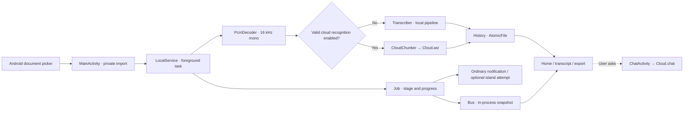
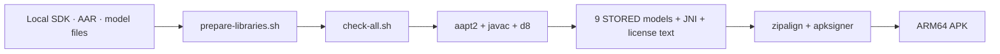

<p align="center"><a href="ARCHITECTURE.md">简体中文</a> · <strong>English</strong></p>

# Technical architecture | From file picker to saved result

> [!NOTE]
> This describes the **actual v1.0.3 source**, not a proposed architecture. The app uses Java, Android Views
> and a foreground Service. It needs no WebView, Termux, ADB or local HTTP server at runtime. The published APK
> targets `arm64-v8a`, with min API 26 and target API 35. [Back to the English user guide](../README.en.md#from-installation-to-export).

## Reading map

| Question | Go to |
| :--- | :--- |
| How are import, model setup and recognition connected? | [Data flow](#1-main-data-flow) · [Local pipeline](#2-the-local-engine-is-a-pipeline) |
| What exactly is sent to a cloud provider? | [Optional cloud path](#3-optional-cloud-path) · [Privacy](#6-storage-lifetimes-and-permissions) |
| Can a rebuilt Activity recover the result? | [Lifecycle](#4-state-notifications-and-lifecycle) · [Storage](#6-storage-lifetimes-and-permissions) |
| Is the HyperOS island a hard dependency? | [Notifications & OEM](#5-notifications-and-xiaomi-integration) |
| How is the APK built, and what has been tested? | [Build & verification](#7-building-and-the-limits-of-verification) |

## 1. Main data flow



1. [MainActivity.java](../src/com/example/tingxiejian/MainActivity.java) launches Android `ACTION_OPEN_DOCUMENT`
   for audio or a supported video soundtrack. `ContentResolver` copies **only the chosen file** to
   `getCacheDir()/input-*.audio`; it does not request access to the rest of storage. Imports over **200 MiB**
   are rejected, and only one transcription job runs at a time. Each import gets a separate path, so selecting
   a new file cannot truncate a file the service is still reading.
2. [LocalService.java](../src/com/example/tingxiejian/LocalService.java) receives start/cancel commands, starts
   its foreground notification promptly and handles work in a background thread. It is a same-process Android
   Service, not a remote server. It can continue when the Activity is no longer visible, but **process death does
   not guarantee that the running task will continue or immediately resume**.
3. [PcmDecoder.java](../src/com/example/tingxiejian/PcmDecoder.java) uses Android `MediaExtractor` and
   `MediaCodec` to select an audio track, decode it, mix it to mono and resample continuously to **16 kHz float PCM**.
   Actual container/codec support depends on the device. Decoded audio longer than **one hour** fails;
   the app does not claim unlimited recording length or universal codec support.
4. The service first writes a result through [History.java](../src/com/example/tingxiejian/History.java),
   **then broadcasts completion**, so a stopped screen is not the only holder of that result.
   [TranscriptActivity.java](../src/com/example/tingxiejian/TranscriptActivity.java) reloads stored segments;
   [Exporter.java](../src/com/example/tingxiejian/Exporter.java) creates timecoded TXT, SRT or JSON.
   `ACTION_CREATE_DOCUMENT` lets the user select the output destination.

> [!TIP]
> **Recent** on the home screen shows only the **five newest records**; it is not a paginated database view.
> Each saved transcript is a private JSON file. Export important work: uninstalling the app can remove these files.

## 2. The local engine is a pipeline

| Stage | Implementation | Result and failure behavior |
| :--- | :--- | :--- |
| Model setup | [ModelPrep.java](../src/com/example/tingxiejian/ModelPrep.java) copies **nine STORED files** from APK `assets/model/` into private `models-v1/`, compares file lengths and skips files that are ready | The first copy may be about 500 MiB. **No download**, but free device storage is required. Automatic setup on the home screen asks for terms acceptance; Settings can also prepare models manually, but first transcription still requires acceptance |
| Decode / streaming ASR | `PcmDecoder` → [Transcriber.java](../src/com/example/tingxiejian/Transcriber.java) → sherpa-onnx OnlineRecognizer / Zipformer | A segment is committed at an endpoint or around 20 seconds; measurable progress follows audio duration |
| Recheck | Paraformer OfflineRecognizer re-recognizes each segment | On failure the streaming text is retained with a warning, not described as “corrected” |
| Punctuation | CT-Transformer `OfflinePunctuation` | On failure text is retained with a warning |
| Anonymous diarization (optional) | pyannote segmentation, speaker embeddings and clustering assign anonymous labels by time overlap | Automatic speaker-count estimation by default, or a user-supplied count. **Skipped above 40 minutes** to limit whole-recording memory use; failures generate warnings |

Labels such as A/B are **not real-name voice identification**. Noise, overlapping voices and long recordings
can reduce segmentation or speaker-count accuracy.

Streaming recognition also computes a waveform overview of about 200 peak buckets at most. Intermediate PCM
stays in private cache and `Transcriber.transcribe()` deletes it when that method exits. Some JNI/native calls
and whole-recording diarization cannot stop promptly: **Cancel** propagates at available decoding/event boundaries,
not necessarily immediately.[^cancel]

## 3. Optional cloud path

Configure it under **Settings → Cloud AI** (`设置 → 云端 AI`). MiMo and DeepSeek presets or a custom OpenAI-compatible
address fill default values; whether a model actually works depends on its provider. `Cloud.hasAsr()` requires
**endpoint + API key + ASR model name**, and the cloud-recognition switch must also be on for transcription
otherwise to stay local.

| User action | Destination | Important difference |
| :--- | :--- | :--- |
| **Test connection** | The configured endpoint | Makes a real, small chat request; provider usage may be charged |
| Enable and start **cloud recognition** | The configured ASR service | `LocalService.CloudChunker` divides decoded audio into **up to 120-second** 16 kHz mono WAV chunks, Base64-encoded in the `input_audio` request. Results are chunk-level time ranges; **local Paraformer recheck, punctuation and diarization are not applied** |
| Send a message after **Ask AI** in a transcript | The configured chat service | [ChatActivity.java](../src/com/example/tingxiejian/ChatActivity.java) includes up to 12,000 characters of transcript context plus conversation messages. Per-recording chats are saved locally; clearing one requires confirmation |

[Cloud.java](../src/com/example/tingxiejian/Cloud.java) is the application's HTTP request entry point.
Endpoints must use HTTPS except local loopback HTTP; redirects carrying a key are not followed automatically,
and responses are limited to 2 MiB. API keys are kept in private `SharedPreferences`—**not claimed to be
hardware-encrypted**—and the cloud configuration can be cleared in Settings. Without a user-configured key,
these cloud requests do not run. Starting transcription and sending a chat message are separate actions;
offline by default does not mean the APK lacks the `INTERNET` permission.[^network]

## 4. State, notifications and lifecycle

```mermaid
sequenceDiagram
    participant U as User
    participant A as MainActivity
    participant S as LocalService
    participant H as History
    participant B as Bus
    U->>A: Choose file and start
    A->>S: ACTION_START + private path + options
    S-->>B: phase / progress
    B-->>A: bounded UI update
    S->>H: persist result with AtomicFile
    H-->>S: saved_id
    S-->>B: result(saved_id)
    B-->>A: show saved result
    Note over A,B: Activity rebuilds: re-subscribe to Bus snapshot; load saved History
```

- [Job.java](../src/com/example/tingxiejian/Job.java) maps real events into monotonic progress.
  Recognition takes `0–90%`; recheck, punctuation and diarization share the remainder. Where internal progress
  cannot be measured, the UI shows elapsed time and an “unavailable” estimate instead of fabricating a percentage.
  The same map drives the home screen, notification and optional OEM payload.
- [Bus.java](../src/com/example/tingxiejian/Bus.java) holds **in-process** listeners and the latest snapshot;
  it is not IPC, a database or HTTP. Worker events are delivered to an Activity that posts UI changes onto
  the main thread. A re-created screen can redraw from the snapshot; durable completion relies on `History`.
  **Bus snapshots vanish when the process dies.**
- Screens subscribe in `onStart` and unsubscribe in `onStop`; the service tracks the active path and engine,
  so a rebuilt screen can recover a task summary. The export picker restores only format/record ID, then
  regenerates content from `History` to avoid an empty export after rotation.
- The home screen switches among idle, preparation, running and completed panels; transitions cancel old
  animations and reset translation/alpha. [WelcomeActivity.java](../src/com/example/tingxiejian/WelcomeActivity.java)
  retains four-page state; [WelcomeHandoff.java](../src/com/example/tingxiejian/WelcomeHandoff.java) cleans up
  its overlay after interruption. [PortalTransition.java](../src/com/example/tingxiejian/PortalTransition.java)
  handles reversible shared-element transitions; [UiTheme.java](../src/com/example/tingxiejian/UiTheme.java)
  handles themes and system/keyboard insets. [Motion.java](../src/com/example/tingxiejian/Motion.java)
  respects both system animation settings and the in-app reduced-motion preference.

## 5. Notifications and Xiaomi integration

`LocalService` retains an ordinary foreground notification as a fallback. A Xiaomi/HyperOS island is an
**extra attempt**, not a transport required for transcription. An enabled setting or authorization cannot
guarantee that SystemUI renders it.

```text
LocalService / Job
  └─ ordinary silent foreground notification
       └─ optional: XiaomiIslandCapability checks ROM / protocol / feature / gate
            └─ XiaomiXmsfValidationGate + ShizukuIslandBridge (explicit authorization)
                 └─ XiaomiIslandPayloadBuilder → XiaomiIslandPublisher
                      └─ failure keeps the ordinary notification
```

`XiaomiIslandCapability` distinguishes non-Xiaomi, unsupported and “eligible to attempt submission”; an
accepted submission is not proof of display. The experimental Shizuku route can **temporarily modify XMSF
network rules and affect other apps' connections or push notifications**. The code saves the prior state,
reads back changes and attempts to restore it; if interrupted, it schedules repair for the next launch.
**Immediate restoration is not guaranteed when Shizuku is unavailable**. This implementation does not activate
an originally disabled shared firewall chain just to enable the island. See
[ShizukuIslandBridge.java](../src/com/example/tingxiejian/ShizukuIslandBridge.java) and
[third-party notices](../THIRD_PARTY_NOTICES.md).

## 6. Storage lifetimes and permissions

| Data | Location / representation | Clearing and recovery |
| :--- | :--- | :--- |
| Imported audio | `getCacheDir()/input-*.audio`, a separate private copy per import | Settings → clear temporary audio. Playback may then be unavailable, **but saved text remains** |
| Intermediate decoded audio | `getCacheDir()/audio-*.pcm` | `Transcriber` attempts removal on task exit; a crash/process death can leave temporary files for later cache cleanup |
| Models | `getFilesDir()/models-v1/`, first copied from APK | Re-prepared if file lengths mismatch, never auto-downloaded |
| Transcript history | `getFilesDir()/history/<id>.json`, written with `AtomicFile`; individual reads capped at 128 MiB | Private local files; upgrades depend on matching signing identity and installation method, and uninstall usually removes them |
| Chats | `getFilesDir()/chat/<id>.json` | Clearing the current recording's chat requires confirmation and does not delete transcript history |
| Preferences and API key | Private `SharedPreferences` | Cloud configuration can be cleared; no claim of encryption or automatic backup |
| Diagnostics | Private text under `getFilesDir()` | Viewed from Settings; **not automatically published to public Downloads**. Redact before sharing |

<details>
<summary><strong>Example: shape of a history record</strong></summary>

This is an illustrative structure, **not** an actual transcript. Only main fields are shown. `speaker` is an
anonymous numeric label; cloud-recognition segments use `speaker: -1` for unknown, not local diarization:

```json
{
  "id": "example-record-id",
  "name": "meeting.m4a",
  "createdAt": 0,
  "durationSeconds": 12.3,
  "engine": "local",
  "speakers": 1,
  "warning": "",
  "text": "",
  "segments": [
    { "start": 0.0, "end": 12.3, "speaker": 0, "text": "Example words from a recording." }
  ]
}
```

The UI builds a readable transcript from `segments`. `text` is a raw field carried from a service event and
is not guaranteed to hold the full text on its own. Real names, timestamps and segments depend on the run.

</details>

`AndroidManifest.xml` declares `INTERNET` (optional cloud functions), notification, foreground-service,
vibration and optional Shizuku permissions. It **does not** request microphone or broad storage access.
`allowBackup=false`; do not assume reinstalling will migrate your data.

> [!CAUTION]
> Bundled models and dependencies remain subject to their own terms. In particular, streaming Zipformer
> redistribution terms and the provenance of `embed.onnx` remain unverified. **User acceptance of app terms
> cannot grant the publisher missing redistribution rights.** See the [third-party notices](../THIRD_PARTY_NOTICES.md)
> and [disclaimer](../DISCLAIMER.en.md).

## 7. Building and the limits of verification



- [build.sh](../build.sh) compiles/links resources with `aapt2`, compiles Java using `javac --release 8`,
  generates DEX via `d8`, packs sherpa-onnx ARM64 JNI and models, then aligns, signs and checks DEX, ZIP
  structure and resources. It runs JDK 21 producing Java 8 bytecode; there is no Gradle or WebView runtime.
  Nine model assets use **ZIP_STORED** so `AssetManager.openFd()` can read their lengths.
- [scripts/prepare-libraries.sh](../scripts/prepare-libraries.sh) and its hash list check the Maven
  downloads. **Manually supplied Android SDK, sherpa AAR and models are not provenance-checked by that
  Maven list.** A clean clone without appropriate rights and inputs cannot build the complete offline APK.
  See the [building guide](BUILDING.en.md).
- `bash design-tools/check-all.sh` runs pure Java, view/color/transition-structure, export, cloud-boundary and
  island-payload checks; `build.sh` also verifies signatures, model counts and DEX. Passing these checks
  **does not prove** absence of flashing, memory pressure or data loss on a real device, or that an island
  was displayed. See the [device motion checklist](UI-MOTION.en.md).

[^cancel]: Streaming decode callbacks check cancellation, but some JNI calls and whole-recording diarization offer no fine-grained interruption point.
[^network]: Address, key and switch are independent. Filling a key does not automatically switch every local transcription to cloud; cloud ASR also needs a valid ASR model name.
