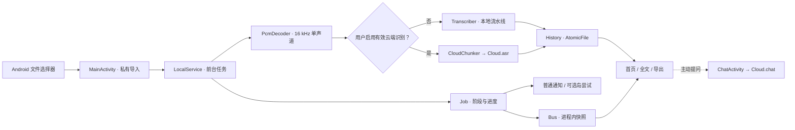
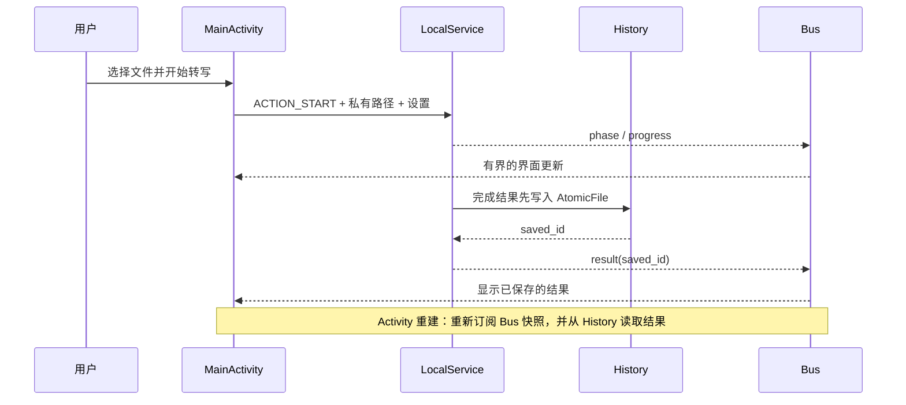
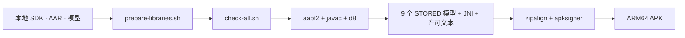

# 技术架构｜从选文件到保存结果

> [!NOTE]
> 本文描述 **v1.0.3 源码中的实际路径**，不是架构愿景。应用为 Java + Android Views + 前台 Service，
> 安装后无需 WebView、Termux、ADB 或常驻本地 HTTP 服务。公开 APK 为 `arm64-v8a`，最低 API 26，目标 API 35。
> [返回 README 使用指南](../README.md#从安装到导出)。

## 阅读地图

| 想弄清什么 | 从这里进入 |
| :--- | :--- |
| 选择文件、模型、识别是如何串起来的？ | [主链路](#一主链路数据怎么流动) · [离线引擎](#二离线引擎分阶段而不是一个黑盒) |
| 云端功能究竟传什么？ | [云端分支](#三可选云端分支) · [隐私边界](#六存储生命周期与权限边界) |
| Activity 重建时结果会不会丢？ | [状态与恢复](#四状态通知与生命周期) · [本地存储](#六存储生命周期与权限边界) |
| 超级岛是核心依赖吗？ | [通知与 OEM 适配](#五通知与小米兼容层) |
| 如何复现构建、验证哪些事情？ | [构建与验证](#七构建与验证边界) |

## 一、主链路：数据怎么流动



1. [MainActivity.java](../src/com/example/tingxiejian/MainActivity.java) 通过 `ACTION_OPEN_DOCUMENT`
   请求系统选择音频（也允许系统支持的视频音轨）；`ContentResolver` 把**选中的一个文件**复制为
   `getCacheDir()/input-*.audio`，不是向原文件索取整盘读取权限。超过 **200 MiB** 的导入会拒绝；
   同时只允许一个转写任务。新导入拥有独立路径，不会截断服务正在读的文件。
2. [LocalService.java](../src/com/example/tingxiejian/LocalService.java) 接收启动／取消命令，
   在工作线程处理，前台通知尽早启动；它是同进程 `Service`，不是远端服务器。Activity 离开页面时，
   服务可以继续执行；系统终止进程则**不能保证任务继续或立即恢复**。
3. [PcmDecoder.java](../src/com/example/tingxiejian/PcmDecoder.java) 用 Android `MediaExtractor` / `MediaCodec`
   找音轨、解码、合成单声道并连续重采样到 **16 kHz 浮点 PCM**。实际能读的封装和编码取决于设备解码器；
   输出超过 **1 小时**会报错，不宣称支持任意格式／无限长录音。
4. 识别结果先由服务调用 [History.java](../src/com/example/tingxiejian/History.java) **持久化，再广播**，
   避免页面已停止时只收到一条转瞬即逝的结果事件。[TranscriptActivity.java](../src/com/example/tingxiejian/TranscriptActivity.java)
   再从记录读取分段，[Exporter.java](../src/com/example/tingxiejian/Exporter.java) 生成 TXT（带时间）、
   SRT 或 JSON，`ACTION_CREATE_DOCUMENT` 让用户指定保存位置。

> [!TIP]
> 首页“最近”只列**最近 5 条**，不是数据库分页视图；记录本身是应用私有目录中的独立 JSON 文件。
> 建议及时导出重要成果；卸载应用可能删除这些文件。

## 二、离线引擎：分阶段而不是一个黑盒

| 阶段 | 实现 | 输出／失败行为 |
| :--- | :--- | :--- |
| 模型准备 | [ModelPrep.java](../src/com/example/tingxiejian/ModelPrep.java) 将 APK `assets/model/` 中的 **9 个 STORED 文件**复制到私有 `models-v1/`；按文件长度检查完整性，跳过已就绪文件 | 首次可能复制约 500 MiB，**无需下载**但需要本机可用空间；首页自动准备前要求条款确认，设置页也可手动准备，首次转写仍要求确认 |
| 解码与流式识别 | `PcmDecoder` → [Transcriber.java](../src/com/example/tingxiejian/Transcriber.java) → sherpa-onnx OnlineRecognizer / Zipformer | 每段到端点或约 20 秒提交一段；阶段进度与真实音频时长关联 |
| 文本复核 | Paraformer OfflineRecognizer 对识别段逐段重识别 | 若失败，保留流式文本并给出警告，不伪造“已校正” |
| 恢复标点 | CT-Transformer 的 `OfflinePunctuation` | 失败时保留文字，附警告 |
| 匿名分人（可关） | pyannote segmentation + speaker embedding + 聚类，以重叠时间为分段附匿名说话人标签 | 默认自动估计，也可在设置中选择人数；超过 **40 分钟**不执行分人，避免整段音频内存开销；失败时警告 |

> 匿名标签 A/B 等**不是声纹实名识别**。有噪声、多人同时说话或过长录音时，分段和人数可能不准确。

流式识别时同时构建不超过约 200 个峰值桶的波形概览，PCM 中间文件放在私有缓存并在
`Transcriber.transcribe()` 结束时删除。JNI/native 识别与整段分人的某些调用不能及时中断：
“取消转写”会在可用的事件和解码边界传播，**不保证每次立即停止**。[^cancel]

## 三、可选云端分支

配置入口是**设置 → 云端 AI**。预设有 MiMo、DeepSeek，以及可手填的 OpenAI 兼容地址；
预设仅填默认值，实际模型可用性由提供方决定。`Cloud.hasAsr()` 要求**服务地址 + API Key + 识别模型名**；
转写还必须打开“云端识别”开关，否则仍走本地引擎。

| 用户操作 | 发往何处 | 重要区别 |
| :--- | :--- | :--- |
| 点“测试连接” | 用户配置的服务地址 | 发送一条实际的小型聊天请求；可能产生提供方用量 |
| 启用并使用“云端识别” | 用户配置的语音识别接口 | `LocalService.CloudChunker` 把解码音频按**最多 120 秒**分成 16 kHz 单声道 WAV，Base64 作为 `input_audio` 请求体上传；返回的是块级时间段，**此路径不做本地 Paraformer／标点／匿名分人** |
| 在全文点“问 AI”并发送消息 | 用户配置的聊天接口 | [ChatActivity.java](../src/com/example/tingxiejian/ChatActivity.java) 将本地转写作为上下文（最多 12,000 字符），附上当前对话消息；本地保存每条录音的对话记录，清空前询问确认 |

[Cloud.java](../src/com/example/tingxiejian/Cloud.java) 是应用 HTTP 请求入口：接口地址要求 HTTPS
（仅本机 loopback 可用 HTTP），不自动追随带密钥的重定向，响应限制 2 MiB。
API Key 存在应用私有 `SharedPreferences` 中，**不是声称硬件加密的保险库**；清除云配置可从设置完成。
未主动配置密钥时，这些云端请求不会运行。语音“开始转写”和聊天“发送”是两个独立动作；
默认离线不等于应用没有 `INTERNET` 权限。[^network]

## 四、状态、通知与生命周期



- [Job.java](../src/com/example/tingxiejian/Job.java) 把实际处理事件映射为单调进度：识别占
  `0–90%`，复核／标点／分人分享余量；无内部进度的阶段显示耗时和“无法估算”，**不伪造实时百分比**。
  同一个映射用于首页、通知和可选 OEM 载荷。
- [Bus.java](../src/com/example/tingxiejian/Bus.java) 是**进程内**监听器和最后快照缓存，
  不是 IPC、数据库或 HTTP。后台工作线程发出事件；Activity 自行切回 UI 线程。Bus 快照能让
  重建的页面尽快重绘；真正的完成结果靠 `History` 持久化，**进程死亡后 Bus 快照会消失**。
- 页面 `onStart` 订阅、`onStop` 取消订阅；服务标记活动路径／引擎，重建页面可恢复任务概要。
  选择器回来后的导出仅保存格式／记录 ID，再从 `History` 生成正文，避免旋转后空文件。
- 首页有空闲、准备、运行、完成四种互斥面板；转场前取消旧动画并重置位置／透明度。
  [WelcomeActivity.java](../src/com/example/tingxiejian/WelcomeActivity.java) 保留四页状态，
  [WelcomeHandoff.java](../src/com/example/tingxiejian/WelcomeHandoff.java) 在生命周期打断时清理遮罩。
  [PortalTransition.java](../src/com/example/tingxiejian/PortalTransition.java) 管理共享元素往返；
  [UiTheme.java](../src/com/example/tingxiejian/UiTheme.java) 处理明暗主题与系统栏／键盘安全区，
  [Motion.java](../src/com/example/tingxiejian/Motion.java) 同时检查系统动画与应用“减少动效”。

## 五、通知与小米兼容层

`LocalService` 始终以普通前台通知作为回退；小米／HyperOS 的顶部岛是**附加尝试**，
不是转写所依赖的传输通道。设置项和用户授权不能保证设备实际渲染。

```text
LocalService / Job
  └─ 普通前台通知（静音）
       └─ 可选：XiaomiIslandCapability 判定 ROM / 协议 / 特性 / 门禁
            └─ XiaomiXmsfValidationGate + ShizukuIslandBridge（明确授权）
                 └─ XiaomiIslandPayloadBuilder → XiaomiIslandPublisher
                      └─ 失败时继续使用普通通知
```

`XiaomiIslandCapability` 区分非小米、能力不足和“可尝试提交”，不把成功提交等同于 SystemUI 已显示。
Shizuku 实验路径可能**短暂更改 XMSF 网络规则，影响其他应用连接或推送**；源码先保存旧状态、
读回并尝试恢复，进程中断时留待下次启动修复。Shizuku 不可用时**无法保证立即恢复**；
当前实现不会为了开启岛而激活原本关闭的共享防火墙链。细节见
[ShizukuIslandBridge.java](../src/com/example/tingxiejian/ShizukuIslandBridge.java) 与
[第三方说明](../THIRD_PARTY_NOTICES.md)。

## 六、存储、生命周期与权限边界

| 数据 | 位置 / 表现 | 清理或恢复方式 |
| :--- | :--- | :--- |
| 选中的音频 | `getCacheDir()/input-*.audio`，逐份独立导入 | 设置 → 清除临时音频；清后可能无法在结果页试听，**不会删除已保存文字** |
| 解码中间音频 | `getCacheDir()/audio-*.pcm` | 任务结束后由 `Transcriber` 尽力删除；异常／进程死亡后的临时文件仍需缓存清理策略 |
| 模型 | `getFilesDir()/models-v1/`；初次从 APK 复制 | 长度不匹配时重新准备，非自动联网下载 |
| 转写历史 | `getFilesDir()/history/<id>.json`，`AtomicFile` 原子写入；一次最多读取 128 MiB | 记录保留在应用私有目录；升级保留与否取决于签名及安装方式，卸载通常删除 |
| 对话 | `getFilesDir()/chat/<id>.json` | 清空当前录音对话要确认；不影响转写历史 |
| 偏好与 API Key | 应用私有 `SharedPreferences` | 可在设置清空云配置；不宣称加密或自动备份 |
| 诊断 | `getFilesDir()` 下私有文本 | 设置中按需查看，**不会自动导出到公共 Download**；分享前须脱敏 |

<details>
<summary><strong>展开看一条历史记录的字段形状</strong></summary>

以下是结构示例，**不是**对真实录音的转写；仅展示主要字段。`speaker` 是匿名数字标签，
云端识别的分段可能没有该标签：

```json
{
  "id": "示例记录-id",
  "name": "会议录音.m4a",
  "createdAt": 0,
  "durationSeconds": 12.3,
  "engine": "local",
  "speakers": 1,
  "warning": "",
  "text": "",
  "segments": [
    { "start": 0.0, "end": 12.3, "speaker": 0, "text": "这是一段示例文字。" }
  ]
}
```

UI 以 `segments` 生成可读全文；`text` 是服务事件保存的原始字段，不保证单独含有完整文本。
真正的文件名、时间戳和分段取决于运行结果。

</details>

`AndroidManifest.xml` 声明 `INTERNET`（可选云功能）、通知、前台服务、振动和可选 Shizuku
权限；**没有**录音和全盘文件访问权限。`allowBackup=false`；不要把重新安装当作数据迁移方式。

> [!CAUTION]
> 所有 APK 内模型及依赖仍遵循各自的许可；特别是流式 Zipformer 的再分发条款、
> `embed.onnx` 的来源尚未核实。应用内同意使用条款**不能补足发布方的再分发权**。
> 见[第三方清单](../THIRD_PARTY_NOTICES.md)和[免责声明](../DISCLAIMER.md)。

## 七、构建与验证边界



- [build.sh](../build.sh) 通过 `aapt2` 编译并链接资源、`javac --release 8` 编译 Java、`d8`
  生成 DEX，打包 sherpa-onnx 的 arm64 JNI 库和模型，最终对齐、签名，并检查 DEX／ZIP／资源。
  用 JDK 21 编译 Java 8 字节码；没有 Gradle/WebView 运行时。9 个模型资源以 **ZIP_STORED**
  形式存入 APK，确保 `AssetManager.openFd()` 能读出长度。
- [scripts/prepare-libraries.sh](../scripts/prepare-libraries.sh) 及其哈希文件检查从 Maven 下载的
  依赖；**手工提供的 Android SDK、sherpa AAR 和模型没有被该 Maven 清单验证来源**。
  无对应权利和输入的干净克隆不能完整构建离线 APK。[完整构建条件](BUILDING.md)。
- `bash design-tools/check-all.sh` 覆盖纯 Java 逻辑、视图／颜色／转场结构、导出、云端边界和岛载荷；
  `build.sh` 还检查签名、模型数量、DEX 等。通过这些检查**不等于**证明在真实机型无闪屏、
  无内存压力、无数据丢失或确实出现超级岛。[动效测试待办](UI-MOTION.md)。

[^cancel]: 本地流式解码的回调会检查取消标志，但某些 JNI 调用和整段分人没有细粒度中止点。
[^network]: 地址、密钥和开关是相互独立的：填写 Key 本身不会自动把所有本地转写切换为云端；打开云端识别还要有有效的 ASR 模型名。
